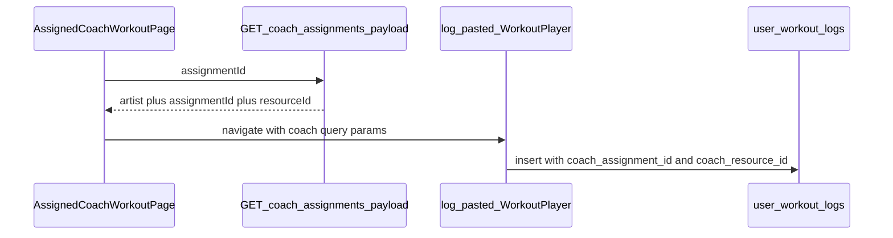

# Bedrock: Unify `assignment_id` and `workouts.id` on assigned-workout completion logs

## Problem

- [`AssignedCoachWorkoutPage`](apps/app/src/components/react/hud/AssignedCoachWorkoutPage.tsx) loads [`/api/me/coach-assignments/:id/payload`](apps/app/src/pages/api/me/coach-assignments/[assignmentId]/payload.ts) but **`onLogWorkout` sends users to `/workout/log-pasted` with no query params**, so completion never ties to `client_coach_assignments.id` or `public.workouts.id`.
- [`saveWorkoutLog`](apps/app/src/lib/supabase/client/tracking.ts) writes only [`user_workout_logs`](apps/app/supabase/migrations/00001_initial_schema.sql) program/week/workout strings—**no coach linkage**.
- [`getCoachAssignmentPayloadForClient`](apps/app/src/lib/supabase/admin/trainer-client-assignments.ts) already resolves `resource_id` for `workout` / `wod` but the API response does not expose **`assignmentId` + `resourceId`** for the client to log.

Without these columns, **AI vs manual completion rates and assignment efficacy cannot be computed**.

## Target data model

| Column | Purpose |
|--------|---------|
| `coach_assignment_id` | `client_coach_assignments.id` |
| `coach_resource_id` | Snapshot of `client_coach_assignments.resource_id` at log time (`public.workouts.id` or `generated_wods.id`, etc.) |
| `coach_assignment_type` (optional) | e.g. `workout` \| `wod` — avoids ambiguous joins |

**FK:** Prefer nullable UUIDs without hard FK if assignments might be purged; or `REFERENCES client_coach_assignments(id) ON DELETE SET NULL` on `coach_assignment_id` only.

**Indexes:** Partial indexes on non-null `coach_assignment_id` and `coach_resource_id` for analytics RPCs.

## Implementation steps

### 1. Migration + types

- New SQL migration under [`apps/app/supabase/migrations/`](apps/app/supabase/migrations/) (and root [`supabase/migrations/`](supabase/migrations/) if dual-path).
- Regenerate [`apps/app/src/types/supabase.ts`](apps/app/src/types/supabase.ts).

### 2. Types and `saveWorkoutLog`

- Extend [`WorkoutLog`](apps/app/src/types/tracking.ts) with optional `coachAssignmentId`, `coachResourceId`, optional `coachAssignmentType`.
- Update [`saveWorkoutLog`](apps/app/src/lib/supabase/client/tracking.ts) insert payload.

### 3. Server: payload shape

- Extend [`CoachAssignmentPayloadResult`](apps/app/src/lib/supabase/admin/trainer-client-assignments.ts) for `workout` and `wod` success branches to include **`assignmentId`** (row `id`) and **`resourceId`**.
- Ensure [`payload.ts`](apps/app/src/pages/api/me/coach-assignments/[assignmentId]/payload.ts) JSON includes them (workout/WOD).

### 4. Client: assigned → log-pasted → player

- [`AssignedCoachWorkoutPage`](apps/app/src/components/react/hud/AssignedCoachWorkoutPage.tsx): keep URL `assignmentId`; merge API `assignmentId`, `resourceId`, `assignmentType`; navigate e.g.  
  `/workout/log-pasted?coachAssignmentId=…&coachResourceId=…&coachAssignmentType=workout`
- [`PastedWorkoutPlayerPage`](apps/app/src/components/react/PastedWorkoutPlayerPage.tsx) / [`PastedWorkoutFromHandoff`](apps/app/src/components/react/pasted-workout/PastedWorkoutFromHandoff.tsx) / [`PastedWorkoutSession`](apps/app/src/components/react/pasted-workout/PastedWorkoutSession.tsx): read params, pass to [`WorkoutPlayer`](apps/app/src/components/react/tracking/WorkoutPlayer.tsx).

### 5. WorkoutPlayer

- Add optional `coachAssignmentId`, `coachResourceId` (and type if needed) to [`WorkoutPlayerProps`](apps/app/src/components/react/tracking/WorkoutPlayer.tsx).
- On successful finish, merge into `WorkoutLog` for `saveWorkoutLog`.

### 6. Schedule / HUD (same assignment sessions)

- Investigate [`getUnifiedCalendarEvents`](apps/app/src/lib/calendar-unified.ts) and weekly board payloads for **`source_assignment_id`** ([`trainer-client-weekly-board.ts`](apps/app/src/lib/supabase/admin/trainer-client-weekly-board.ts)).
- Extend [`CalendarEvent`](apps/app/src/lib/calendar-events.ts) metadata (or top-level) when events are coach-assignment-backed.
- Thread into [`ScheduleZone`](apps/app/src/components/react/hud/ScheduleZone.tsx) `handleStartWorkout` → `WorkoutPlayer`; repeat for [`ProgramSidebar`](apps/app/src/components/react/hud/ProgramSidebar.tsx) / [`TodayWorkoutCard`](apps/app/src/components/react/hud/TodayWorkoutCard.tsx) **only where** assignment IDs are available (document gaps).

## Verification

- Assign workout → open `/workout/assigned?assignmentId=` → complete via log path → row in `user_workout_logs` has `coach_assignment_id` and `coach_resource_id` matching DB.
- Optional: unit test for `saveWorkoutLog` payload with coach fields.

## Non-goals (this slice)

- Dual-write to [`workout_logs`](apps/app/src/lib/supabase/client/workout-logs.ts) unless explicitly required.
- Historical backfill of old logs.

## Architecture

