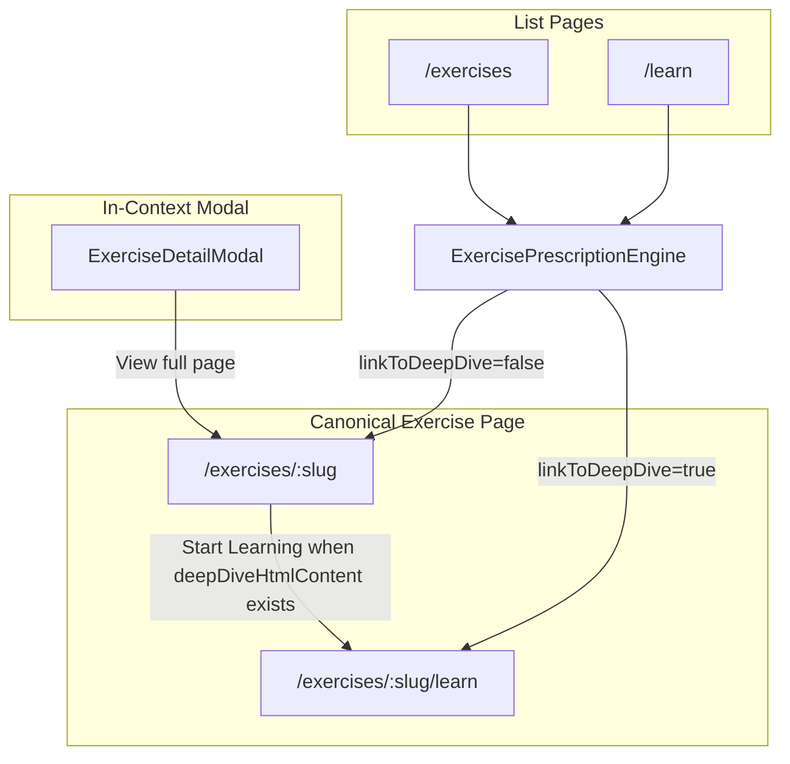

# Deep Dive Page — Design and Workflow

This document describes the **Deep Dive** page: an AI-generated, self-contained HTML guide for exercises. It complements the canonical exercise detail page (`/exercises/[slug]`) with in-depth biomechanics, muscle maps, and step-by-step instructions.

---

## 1. Overview

| Aspect        | Details                                                                          |
| ------------- | -------------------------------------------------------------------------------- |
| **Route**     | `/exercises/[slug]/learn`                                                        |
| **Content**   | AI-generated HTML stored in `GeneratedExercise.deepDiveHtmlContent`              |
| **Rendering** | Raw HTML served directly (sanitized); not an Astro/React page                    |
| **Purpose**   | "Ultimate Guide" — deep biomechanics, muscle maps, instructions, common mistakes |
| **Tone**      | Clinical, educational, encouraging                                               |

### Relationship to Other Views



- **Detail page** (`/exercises/[slug]`) uses the "Iceberg Method" layout (hero, cues, mistakes, accordion). When `deepDiveHtmlContent` exists, it shows a **"Start Learning"** button linking to the deep dive.
- **Deep dive page** (`/exercises/[slug]/learn`) renders the stored HTML as a full standalone document. It does not wrap content in the app layout; the HTML is self-contained (includes its own `<html>`, `<head>`, Tailwind CDN, etc.).
- **Learn index** (`/learn`) lists only exercises that have deep dive content and links directly to `/exercises/[slug]/learn`.
- **Exercises index** (`/exercises`) lists all approved exercises and links to `/exercises/[slug]` by default.

---

## 2. Data Model

| Field                 | Type                  | Description                                                                      |
| --------------------- | --------------------- | -------------------------------------------------------------------------------- |
| `deepDiveHtmlContent` | `string \| undefined` | AI-generated full HTML document. Stored in Firestore `generated_exercises/{id}`. |

- **Optional**: Not all exercises have deep dive content. Only those with content appear on `/learn` and show the "Start Learning" button on the detail page.
- **Immutable until regenerated or edited**: Admin can generate (AI) or edit (manual) via DeepDiveEditor.

---

## 3. Routes and Rendering

### 3.1 Deep Dive Page (`/exercises/[slug]/learn`)

| File                                     | Role                                                                  |
| ---------------------------------------- | --------------------------------------------------------------------- |
| `src/pages/exercises/[slug]/learn.astro` | Route handler; fetches exercise, sanitizes HTML, returns raw response |

**Flow:**

1. Parse `slug` from URL params.
2. Fetch exercise via `getGeneratedExerciseBySlug(slug, false)` — **allow pending** for preview/deep dive access.
3. If no exercise → redirect to `/404`.
4. If no `deepDiveHtmlContent` → redirect to `/exercises`.
5. If content exists:
   - Sanitize with `sanitizeDeepDiveHtml(deepDiveHtmlContent)`.
   - Return `Response` with:
     - `Content-Type: text/html; charset=utf-8`
     - `Content-Security-Policy` (restrict scripts to trusted CDNs; block inline script)
     - `X-Content-Type-Options: nosniff`

The response body is the sanitized HTML string. No Astro layout, no React — the HTML document is fully self-contained.

### 3.2 Why Raw HTML?

The deep dive content is AI-generated as a complete HTML document (with Tailwind CDN, hero section, tables, etc.). Serving it directly:

- Avoids parsing/re-serialization.
- Preserves AI layout and styling.
- Simplifies CSP for embedded scripts (e.g. Tailwind CDN).

---

## 4. Entry Points and Navigation

| Entry Point                          | Destination                                  | Condition                                              |
| ------------------------------------ | -------------------------------------------- | ------------------------------------------------------ |
| Canonical page (`/exercises/[slug]`) | "Start Learning" → `/exercises/[slug]/learn` | `deepDiveHtmlContent` exists                           |
| Learn index (`/learn`)               | Card link → `/exercises/[slug]/learn`        | `linkToDeepDive={true}`; only exercises with deep dive |
| Exercises index (`/exercises`)       | Card link → `/exercises/[slug]`              | `linkToDeepDive={false}` (default)                     |
| ExerciseDetailModal                  | "View full page" → `/exercises/[slug]`       | Canonical page only; no direct deep dive link          |
| Admin (GeneratedExerciseDetail)      | "View Page" → `/exercises/[slug]/learn`      | Admin preview of deep dive                             |

---

## 5. Content Generation and Editing

### 5.1 AI Generation

| File                                                  | Role                                                                                           |
| ----------------------------------------------------- | ---------------------------------------------------------------------------------------------- |
| `src/pages/api/admin/exercises/[id]/generate-page.ts` | POST; admin-only; calls `generateExerciseHtml`, saves to Firestore                             |
| `src/lib/gemini-server.ts`                            | `generateExerciseHtml(exerciseName, imageUrl, biomechanics)` — Gemini model produces full HTML |

**AI Prompt Structure (DEEP_DIVE_SYSTEM_PROMPT):**

1. Title
2. Hero Section (provided image URL)
3. Biomechanics (moment arms, force vectors, kinetic chain)
4. Muscle Map (primary/secondary movers, stabilizers)
5. Step-by-Step Instructions
6. Common Mistakes table

**Inputs to Gemini:**

- Exercise name
- Image URL
- Biomechanics context: chain, pivots, stabilization
- Back link href (default `/exercises`)

**Output:** Raw HTML string (no markdown code fences). Stored in `deepDiveHtmlContent`.

### 5.2 Manual Editing

| File                                                        | Role                                                            |
| ----------------------------------------------------------- | --------------------------------------------------------------- |
| `src/components/react/admin/DeepDiveEditor.tsx`             | Rich editor for `deepDiveHtmlContent`                           |
| `src/pages/api/admin/exercises/[id]/update-deep-dive.ts`    | POST; admin-only; updates `deepDiveHtmlContent` in Firestore    |
| `src/components/react/admin/AdminExerciseDetailWrapper.tsx` | Wires "Generate Deep Dive Page" and "Edit Page" to API + editor |

**Flow:**

1. Admin opens exercise in Admin Lab.
2. **Generate Deep Dive Page** → POST to `/api/admin/exercises/[id]/generate-page` → AI generates, saves, state updates.
3. **Edit Page** → Opens DeepDiveEditor with current HTML → Admin edits → Save → POST to `/api/admin/exercises/[id]/update-deep-dive` with new HTML.

---

## 6. Security — Sanitization and CSP

### 6.1 Sanitization

| File                                 | Role                                                         |
| ------------------------------------ | ------------------------------------------------------------ |
| `src/lib/sanitize-deep-dive-html.ts` | `sanitizeDeepDiveHtml(html)` — XSS mitigation before serving |

**Behavior:**

- Uses `sanitize-html` with expanded allowed tags (script, img, link, style, head, html, body, meta, title).
- Allows `class`, `style`, `id` on any tag so Tailwind and layout survive.
- **Script tags**: Only allowed when `src` is from trusted CDNs:
  - `https://cdn.tailwindcss.com`
  - `https://cdn.jsdelivr.net`
  - `https://unpkg.com`
- Strips inline script, event handlers (`on*`), unknown script sources.
- Removes leftover `tailwind.config = { ... }` text from stripped inline scripts.

### 6.2 Content-Security-Policy

```http
default-src 'self';
script-src 'self' https://cdn.tailwindcss.com https://cdn.jsdelivr.net https://unpkg.com;
style-src 'self' 'unsafe-inline' https:;
img-src 'self' data: https:;
font-src 'self' https:;
connect-src 'self';
frame-ancestors 'self';
base-uri 'self';
form-action 'none';
```

- Inline script is blocked; only CDN scripts allowed.
- Defense-in-depth with sanitizer for stored content.

---

## 7. SEO

| Aspect           | Details                                                                                                         |
| ---------------- | --------------------------------------------------------------------------------------------------------------- |
| **Sitemap**      | `/exercises/[slug]/learn` included only when `ex.deepDiveHtmlContent` exists. Priority 0.7, changefreq monthly. |
| **Indexability** | Page is server-rendered HTML; crawlers receive full content.                                                    |
| **Canonical**    | `/exercises/[slug]` is the primary canonical page; learn is a sub-resource.                                     |

---

## 8. Sources

Sources (citations) follow a single source of truth:

| Where sources come from            | How                                                                                                                                                                                                                                                                                                                                                                                                       |
| ---------------------------------- | --------------------------------------------------------------------------------------------------------------------------------------------------------------------------------------------------------------------------------------------------------------------------------------------------------------------------------------------------------------------------------------------------------- |
| **Basic info / exercise creation** | `researchTopicForPrompt` uses `tools: [{ googleSearch: {} }]`. `groundingMetadata.groundingChunks` are transformed via `transformSearchResultsToSources()` into `ExerciseSource[]` (title, domain, searchQuery). Stored in `exercise.sources`.                                                                                                                                                            |
| **Deep dive content**              | `generateExerciseHtml()` has no grounding. The model is instructed not to output a Sources section; the application injects one.                                                                                                                                                                                                                                                                          |
| **Display**                        | The same `exercise.sources` are shown on both the detail page (`GeneratedExerciseDetail` section 5) and the learn page. At serve time, `prepareDeepDiveDocument` strips any AI-generated Sources block (e.g. dead "Vertexaisearch" link) and injects a Sources section from `exercise.sources` with search-verification links. If no sources exist, a fallback link to the exercise detail page is shown. |

- **Search verification pattern**: Links use `https://google.com/search?q=...` (site-restricted queries) rather than direct URLs.
- **No duplicate or dead links**: The app controls the Sources section on the learn page; AI-generated placeholder links are removed.

---

## 9. File Reference

| File                                                         | Role                                                  |
| ------------------------------------------------------------ | ----------------------------------------------------- |
| `src/pages/exercises/[slug]/learn.astro`                     | Deep dive route; fetch, sanitize, prepare, serve HTML |
| `src/lib/prepare-deep-dive-document.ts`                      | Strip AI Sources, inject nav bar and Sources section  |
| `src/lib/sanitize-deep-dive-html.ts`                         | XSS sanitization for deep dive HTML                   |
| `src/lib/gemini-server.ts`                                   | `generateExerciseHtml()`, `DEEP_DIVE_SYSTEM_PROMPT`   |
| `src/pages/api/admin/exercises/[id]/generate-page.ts`        | Admin API: AI generate deep dive                      |
| `src/pages/api/admin/exercises/[id]/update-deep-dive.ts`     | Admin API: manual update                              |
| `src/components/react/admin/DeepDiveEditor.tsx`              | Admin editor for deep dive HTML                       |
| `src/components/react/admin/AdminExerciseDetailWrapper.tsx`  | Wires generate/edit in admin UI                       |
| `src/components/react/GeneratedExerciseDetail.tsx`           | Shows "Start Learning" when content exists            |
| `src/pages/learn/index.astro`                                | Learn index; filters to deep-dive exercises           |
| `src/components/react/public/ExercisePrescriptionEngine.tsx` | `linkToDeepDive` prop for Learn vs Exercises          |
| `src/pages/sitemap.xml.ts`                                   | Includes learn URLs when `deepDiveHtmlContent` exists |
| `src/types/generated-exercise.ts`                            | `deepDiveHtmlContent?: string`                        |

---

## 10. Related Docs

- [Exercises Feature](./exercises.md) — Canonical source, views, resolution
- [ExerciseDetailModal](../../../components/modals/workout-detail-modal/exercise-detail-modal/ExerciseDetailModal.md) — In-context modal; "View full page" links to canonical, not learn
