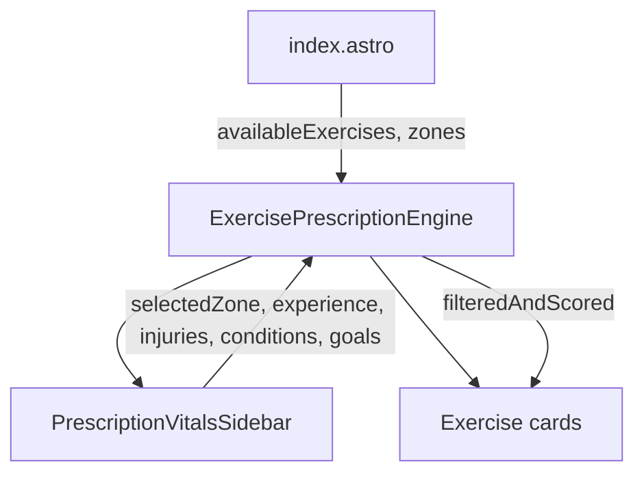

# Exercises Index Page — Overview and Mobile Responsiveness

This document describes the **Exercises Index** page (`/exercises`): its purpose, architecture, layout, and mobile responsiveness. It serves as the public entry point for browsing and filtering published exercises.

---

## 1. Overview

| Aspect        | Details                                                                      |
| ------------- | ---------------------------------------------------------------------------- |
| **Route**     | `/exercises`                                                                 |
| **Component** | `ExercisePrescriptionEngine`                                                 |
| **Data**      | `getPublishedExercises()` — approved exercises from Firestore                |
| **Purpose**   | Browse and filter exercises by experience, zone, injuries, conditions, goals |
| **Links to**  | `/exercises/[slug]` (or `/exercises/[slug]/learn` when used from `/learn`)   |

### Page Flow

```
/exercises → index.astro → ExercisePrescriptionEngine
                              ├── PrescriptionVitalsSidebar (filters)
                              └── Exercise cards (top match + alternatives)
```

The page uses the same Vitals-based filtering pattern as the Programs Prescription Engine: users tune their vitals (zone, experience, injuries, conditions, goals), and exercises are ranked in real time by match score.

---

## 2. Architecture

### 2.1 File Structure

| File                                                         | Role                                                            |
| ------------------------------------------------------------ | --------------------------------------------------------------- |
| `src/pages/exercises/index.astro`                            | Route; loads exercises and zones server-side; mounts the engine |
| `src/components/react/public/ExercisePrescriptionEngine.tsx` | Main UI: header, sidebar, exercise cards                        |
| `src/components/react/public/PrescriptionVitalsSidebar.tsx`  | Sidebar: zone, experience, injuries, conditions, goals          |
| `src/components/react/GridCard.tsx`                          | Card layout for exercise items (image, title, match ring)       |

### 2.2 Data Flow



- **Server-side**: `index.astro` fetches `getPublishedExercises()` and `getAllZonesServer()`, passes them as props.
- **Client-side**: `ExercisePrescriptionEngine` holds filter state and computes `filteredAndScored` via `useMemo`. Cards re-render as filters change.

---

## 3. Layout and Content Sections

### 3.1 Header

- **Title**: "Exercise Prescription Engine"
- **Subtitle**: "Tune your vitals — we rank exercises in real time"
- **Terminate Session** button: links to `/` (home)

### 3.2 PrescriptionVitalsSidebar (Filters)

| Section            | Content                                                               |
| ------------------ | --------------------------------------------------------------------- |
| Equipment / Zone   | "Any" + zone buttons (e.g. Living Room, Big Box Gym, Home Gym, Hotel) |
| Experience         | Any, Beginner, Intermediate, Advanced                                 |
| Injuries           | Body-part pills by region (Spine & Torso, Upper Body, Lower Body)     |
| Medical Conditions | Pills for conditions (e.g. Herniated Disc, Sciatica, Carpal Tunnel)   |
| Goals              | Pills by category (Aesthetic, Performance, Health)                    |

Injury and condition selections trigger an optional **medical disclaimer modal** before exercises are filtered.

### 3.3 Exercise Cards

1. **Top match** — When a specific experience level is selected: single highlighted card with "Top match for your vitals", match score ring, complexity/kinetic chain tags, and "View Exercise" / "Start Learning" link. When Experience is "Any", no top match is shown — all exercises appear in the alternatives grid.
2. **Alternatives** — Grid of cards with match score ≥ 30. Each shows image, name, match ring, tags, and "View" link. When "Any" is selected, exercises are sorted alphabetically by name.
3. **Lower match** — (Optional) Cards with match score &lt; 30, shown in a separate grayscale section when present.

### 3.4 Matching Logic

- **Experience** — Any: experience does not affect ranking; exercises sorted alphabetically; no top match. Specific level: exact match 100; adjacent level 80; two levels away 50.
- **Injuries** — Exercises that load selected injury areas are hidden.
- **Conditions** — Certain conditions map to injury IDs or modifier tags; conflicting exercises are hidden.
- **Goals** — Goals only affect ranking; exercises passing injury/condition filters get bonus points for goal alignment.

---

## 4. Responsive Layout

### 4.1 Breakpoint Behavior

| Breakpoint          | Behavior                                                                                     |
| ------------------- | -------------------------------------------------------------------------------------------- |
| Below `lg` (1024px) | Filters in slide-out drawer from right; "Filters" button opens it; exercise cards full width |
| `lg` (1024px)+      | Two columns: sidebar 320px inline, exercise cards fill remainder                             |

Below `lg`, the **Drawer** component is used: filters move into a slide-out panel from the right. A "Filters" button (with SlidersHorizontal icon) in the header opens the drawer. Exercise cards occupy full width. At `lg` and above, the sidebar remains inline in the grid (`grid gap-10 lg:grid-cols-[320px_1fr]`).

### 4.2 Header

- **Mobile**: `flex-col` — title and actions stack vertically. A "Filters" button appears before "Terminate Session" to open the drawer.
- **Desktop (md+)**: `flex-row md:items-end` — horizontal layout, "Filters" hidden (sidebar inline), "Terminate Session" aligns to bottom.

### 4.3 Exercise Cards Grid

- **Mobile**: Single column (`grid` without `sm:grid-cols-2`).
- **sm (640px+)**: Two columns (`sm:grid-cols-2`).

### 4.4 Spacing and Typography

- Container: `px-4 py-10 md:px-6`, `max-w-7xl mx-auto`.
- Title: `text-3xl md:text-4xl`.
- Pills and buttons use `flex-wrap` for wrapping on narrow screens.

---

## 5. Mobile Responsiveness

### 5.1 Drawer-Based Filters (Below lg)

Below the `lg` (1024px) breakpoint, filters move into a **Drawer** that slides in from the right:

- **Filters button**: Shown in the header; opens the drawer. Styled with gold accent (`border-[#ffbf00]/50`, `bg-[#ffbf00]/20`).
- **Drawer panel**: Fixed right, `min(320px, 85vw)` width, full height, scrollable content. Backdrop dims the page; click or Escape closes.
- **Content**: `PrescriptionVitalsSidebar` renders inside the drawer with the same filter sections (zone, experience, injuries, conditions, goals).

This keeps exercise cards immediately visible on mobile without scrolling past the filter section.

### 5.2 What Works Well

| Aspect            | Implementation                                                             |
| ----------------- | -------------------------------------------------------------------------- |
| Drawer pattern    | Filters in slide-out drawer below lg; exercises full width from top        |
| Header            | Stacks vertically on mobile; "Filters" + "Terminate Session" in a row      |
| Exercise cards    | Single column on mobile, two columns from 640px                            |
| Overflow handling | `min-w-0` on flex children, `line-clamp-2` on titles, `flex-wrap` on pills |
| Touch targets     | Pills and buttons use adequate padding (`px-3 py-2`, `px-3 py-1.5`)        |
| Viewport          | Correct viewport meta in BaseLayout                                        |

### 5.3 Considerations

#### Long Filter Content in Drawer

The sidebar includes many filter sections. The drawer panel has `overflow-y-auto`, so users scroll within the drawer when needed. The drawer closes on backdrop click or Escape.

#### Long Zone Labels

Labels such as "Living Room (Minimalist)" and "Home Gym (Garage Iron)" may wrap on very narrow screens. The `flex-wrap` on pill containers handles wrapping; legibility is generally maintained.

#### GridCard Padding

`GridCard` uses `px-8` on the header content. On screens around 320px wide, this can feel tight. A responsive adjustment (e.g. `px-4 sm:px-6 md:px-8`) could improve spacing on the smallest viewports if needed.

#### Disclaimer Modal

The medical disclaimer modal uses `max-w-md` and `px-4`. At 375px width and below, the content fits; on very narrow devices (e.g. 320px), visual verification is recommended.

### 5.4 Programs Index

The **Program Prescription Engine** (`/programs`) uses the same drawer pattern: below `lg`, filters move into the right-side drawer with a "Filters" button. See [ProgramPrescriptionEngine.tsx](../../../src/components/react/public/ProgramPrescriptionEngine.tsx).

### 5.5 Mobile Testing Recommendations

- **Viewports**: Test at 375×667 (iPhone SE), 390×844 (iPhone 14), and 320×568 (small phones).
- **Drawer**: Verify the "Filters" button opens the drawer, backdrop closes it, Escape closes it, and scrolling works within the drawer.
- **Touch**: Verify all filter pills and card links are easy to tap without accidental selections.

---

## 6. File Reference

| File                                                         | Role                               |
| ------------------------------------------------------------ | ---------------------------------- |
| `src/pages/exercises/index.astro`                            | Exercises index route              |
| `src/components/react/public/ExercisePrescriptionEngine.tsx` | Main page component                |
| `src/components/react/Drawer.tsx`                            | Slide-out panel for mobile filters |
| `src/hooks/useMediaQuery.ts`                                 | Breakpoint detection for drawer    |
| `src/components/react/public/PrescriptionVitalsSidebar.tsx`  | Filter sidebar                     |
| `src/components/react/GridCard.tsx`                          | Exercise card layout               |
| `src/lib/firebase/public/generated-exercise-service.ts`      | `getPublishedExercises()`          |
| `src/lib/firebase/admin/server-equipment.ts`                 | `getAllZonesServer()`              |

---

## 7. Related Docs

- [exercises.md](./exercises.md) — Canonical source, list pages, data flow
- [deep-dive-page.md](./deep-dive-page.md) — `/exercises/[slug]/learn` and Learn index
- [exercise-detail-foundation.md](./exercise-detail-foundation.md) — ExerciseDetailModal contract
