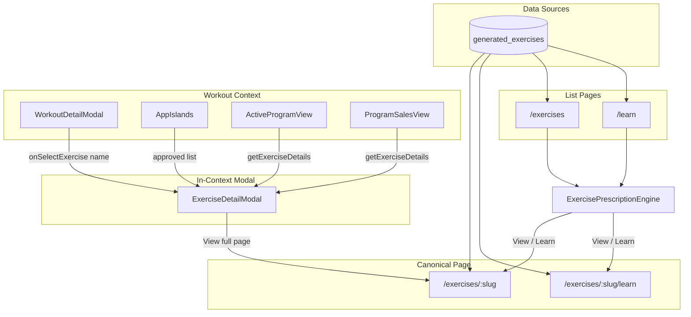
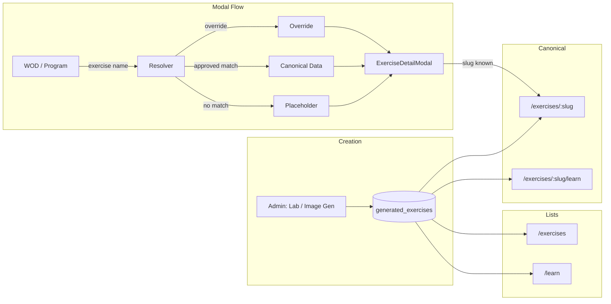

# Exercises Feature — Canonical Source, Views, and Navigation

This document describes the Exercises feature design, the canonical source of truth, how exercise data flows through the app, and recommendations for a cohesive organization that allows seamless navigation across all exercise views from every entry point.

---

## 1. Canonical Source of Truth

**The canonical exercise is the Firestore document in `generated_exercises` with a unique slug.**

| Aspect            | Details                                                                                                                            |
| ----------------- | ---------------------------------------------------------------------------------------------------------------------------------- |
| **Collection**    | `generated_exercises`                                                                                                              |
| **Canonical URL** | `/exercises/[slug]` (e.g. `/exercises/arm-circles`)                                                                                |
| **Identifier**    | `slug` — URL-safe, derived from `exerciseName` via `generateSlug()`                                                                |
| **Status**        | `approved` exercises are public; `pending` / `rejected` are admin-only                                                             |
| **SEO**           | Approved exercises are in the sitemap; the detail page is server-rendered with indexable content (h1, description in initial HTML) |

### Data Model (GeneratedExercise)

Key fields used across views:

- **slug** — URL-safe identifier; forms canonical URL
- **exerciseName** — Display name (e.g. "Arm Circles")
- **imageUrl** — Primary image
- **biomechanics.performanceCues** — Performance cues (the "Deployment Steps" in ExerciseDetailModal)
- **biomechanics.commonMistakes** — Common form errors
- **biomechanics.biomechanicalChain**, **pivotPoints**, **stabilizationNeeds** — Extended biomechanics ("Additional Tactical Data")
- **deepDiveHtmlContent** — Optional HTML for `/exercises/[slug]/learn`

Once an exercise is created and approved, it becomes a permanent part of the SEO content and is discoverable via `/exercises`, `/learn`, sitemap, and internal links.

---

## 2. Exercise Views and Entry Points



### 2.1 Canonical Detail Page

| Route                     | Component                           | Data                                                     |
| ------------------------- | ----------------------------------- | -------------------------------------------------------- |
| `/exercises/[slug]`       | GeneratedExerciseDetail             | `getGeneratedExerciseBySlug(slug, true)` — approved only |
| `/exercises/[slug]/learn` | Raw HTML from `deepDiveHtmlContent` | Same fetch; requires `deepDiveHtmlContent`               |

**GeneratedExerciseDetail** uses the "Iceberg Method" layout:

- Hero (image)
- **Performance Cues** ← `biomechanics.performanceCues` (same source as modal "Deployment Steps")
- Common Mistakes
- Biomechanical chain, pivot points, stabilization (collapsible)
- Deep Dive link (when `deepDiveHtmlContent` exists)
- Sources

### 2.2 List Pages

| Route        | Data                                                        | Links to                                         |
| ------------ | ----------------------------------------------------------- | ------------------------------------------------ |
| `/exercises` | `getPublishedExercises()`                                   | `/exercises/[slug]` or `/exercises/[slug]/learn` |
| `/learn`     | `getPublishedExercises()` filtered by `deepDiveHtmlContent` | `/exercises/[slug]/learn`                        |

Both use **ExercisePrescriptionEngine** with Vitals filtering (experience, zone, injuries, goals). Cards link directly to the canonical URL.

### 2.3 In-Context Modal (ExerciseDetailModal)

Contract and workflows (Workouts, WODs, Tabata, Programs, Complexes) are defined in [exercise-detail-foundation.md](exercise-detail-foundation.md). Opened when the user clicks an exercise in **WorkoutDetailModal** (WOD, program, static workout). The modal shows:

- **Deployment Steps** ← instructions (performance cues when from canonical source)
- **Additional Tactical Data** ← extended biomechanics (chain, pivot, stabilization, common mistakes)
- Images, video (when available)
- **View full page** link → `/exercises/[slug]` (when slug is known)

---

## 3. Exercise Resolution — Who Supplies the Data?

All three parents use the **same resolution order**: approved list first, then warmup/override (where applicable), then static fallback. When the exercise name matches an approved GeneratedExercise (normalized), the modal gets canonical data and slug for the "View full page" link.

| Parent                        | Resolution order                                       | Gets canonical data?             | Gets slug? |
| ----------------------------- | ------------------------------------------------------ | -------------------------------- | ---------- |
| **AppIslands** (WOD / static) | 1. WOD override 2. Approved list 3. getExerciseDetails | Yes (when name matches approved) | Yes        |
| **ActiveProgramView**         | 1. Approved list 2. Warmup block 3. getExerciseDetails | Yes (when name matches approved) | Yes        |
| **ProgramSalesView**          | 1. Approved list 2. Warmup block 3. getExerciseDetails | Yes (when name matches approved) | Yes        |

### Resolution Logic (AppIslands)

```
handleSelectExercise(exerciseName):
  1. If WOD has exerciseOverrides[exerciseName] → use override (slug = null)
  2. If approvedExercisesMap has match (normalized name) → use canonical data, set slug
  3. Else getExerciseDetails(exerciseName) → static placeholder (slug = null)
```

### Resolution Logic (ActiveProgramView / ProgramSalesView)

Both load `getGeneratedExercises('approved')` on mount and build the same maps (exerciseMap, extendedMap, slugMap) via `buildApprovedExerciseMaps`. When the user clicks an exercise:

1. If approved list has a match (normalized name) → use canonical data, set extended biomechanics and slug.
2. Else if the program workout has warmupBlocks with that exercise → use block-specific instructions (no slug).
3. Else getExerciseDetails(exerciseName) → static placeholder (no slug).

The **approved list** in AppIslands is built when any workout is selected (selectedArtist?.workoutDetail): `getGeneratedExercises('approved')` → maps to `Exercise`, `ExtendedBiomechanics`, and slug. So the modal content comes from the canonical source when the exercise name matches an approved GeneratedExercise, in all three parents.

### Static Fallback (getExerciseDetails)

`src/data/exercises.ts` — `EXERCISE_DATABASE` is empty; `getExerciseDetails()` returns a generic placeholder (Unsplash images, generic instructions) for any name not in the database. Programs and WODs with non-approved exercises therefore show placeholder content, not canonical performance cues.

---

## 4. Data Flow Summary



---

## 5. Current Gaps and Inconsistencies

1. **Programs do not use the canonical source**  
   ActiveProgramView and ProgramSalesView use `getExerciseDetails(name)` or warmup block instructions. They never fetch the approved list, so program exercises usually show placeholder or block-specific instructions, not the canonical performance cues from `/exercises/arm-circles`.

2. **Name-based matching is fragile**  
   Matching is `exerciseName.toLowerCase().trim()`. Slight name differences ("Arm Circles" vs "Arm circles") match, but "Band Pull-Aparts" vs "Band Pull Aparts" may not. WOD prescriber and program AI output freeform names; matching depends on exact string alignment.

3. **No slug in workout/program data**  
   WorkoutDetail and program blocks store `exerciseName` only. There is no stored slug, so resolution must always go through name→slug lookup. If the parent does not maintain an approved map (e.g. programs), slug is never available.

4. **WOD exercise overrides bypass canonical**  
   `exerciseOverrides` can replace an exercise entirely with custom images/instructions. That is intentional for admin customization but means the "View full page" link is not shown (override has no slug).

5. **videoUrl not in GeneratedExercise**  
   The `Exercise` type has `videoUrl`; GeneratedExercise does not. Videos currently appear only when provided via overrides or a future field.

---

## 6. Recommendations for Cohesive Organization

### 6.1 Unify exercise resolution across all parents

- **ActiveProgramView** and **ProgramSalesView** should load the approved exercise list (or a name→slug map) when displaying a program, and resolve `onSelectExercise(name)` the same way as AppIslands: override → approved → placeholder.
- Pass `exerciseSlug` to ExerciseDetailModal whenever an approved match exists, so "View full page" appears in all workout contexts.

### 6.2 Prefer slug when available

- Where workout/program data can store a slug (e.g. when saving from a known exercise), persist it. Resolution can then go directly to `/exercises/[slug]` without name matching.
- Program generation could optionally constrain exercise names to approved exercises to improve match rate.

### 6.3 Normalize name matching

- Use a shared normalization function (e.g. `toSlug(name)` or a fuzzy match) for consistent lookup. Document the rules so AI-generated names align with canonical `exerciseName` formats.

### 6.4 Consider slug in program blocks

- If the program builder or AI can reference exercises by slug, store `exerciseSlug` in block data. Fall back to name resolution when slug is absent.

### 6.5 Add videoUrl to GeneratedExercise (optional)

- If exercise videos are part of the canonical content, add `videoUrl` to the GeneratedExercise schema and include it in the modal when resolving from the approved list.

### 6.6 Navigation patterns

- **From modal to canonical**: "View full page" already links to `/exercises/[slug]` (new tab). Keep this pattern.
- **From canonical to related**: Consider "View in Workouts" or "Find in Programs" if cross-linking becomes valuable.
- **Breadcrumbs**: List pages could use "Exercises > [Name]" or "Learn > [Name]" for clarity.

---

## 7. File Reference

| File                                                         | Role                                                    |
| ------------------------------------------------------------ | ------------------------------------------------------- |
| `src/lib/firebase/public/generated-exercise-service.ts`      | Server-side fetch by slug; `getPublishedExercises()`    |
| `src/lib/firebase/client/generated-exercises.ts`             | Client fetch for admin/WOD                              |
| `src/types/generated-exercise.ts`                            | GeneratedExercise, ParsedBiomechanics                   |
| `src/pages/exercises/[slug].astro`                           | Canonical detail page                                   |
| `src/pages/exercises/[slug]/learn.astro`                     | Deep dive page                                          |
| `src/pages/exercises/index.astro`                            | Exercises list                                          |
| `src/pages/learn/index.astro`                                | Learn list (deep dive exercises)                        |
| `src/components/react/GeneratedExerciseDetail.tsx`           | Canonical page component                                |
| `src/components/react/ExerciseDetailModal.tsx`               | In-context modal                                        |
| `src/components/react/public/ExercisePrescriptionEngine.tsx` | List + filtering                                        |
| `src/data/exercises.ts`                                      | Static fallback `getExerciseDetails()`                  |
| `src/lib/parse-biomechanics.ts`                              | `generateSlug()`                                        |
| `src/pages/sitemap.xml.ts`                                   | Includes `/exercises/[slug]`, `/exercises/[slug]/learn` |

---

## 8. Related Docs

- [Exercises Index Page](./exercises-index-page.md) — `/exercises` layout, architecture, mobile responsiveness
- [Deep Dive Page](./deep-dive-page.md) — `/exercises/[slug]/learn` design, generation, sanitization
- [ExerciseDetailModal](../../components/modals/workout-detail-modal/exercise-detail-modal/ExerciseDetailModal.md) — Modal props, UX, SEO
- [DataSources](../../components/modals/workout-detail-modal/DataSources.md) — Artist data sources for WorkoutDetailModal
- [AppIslands](../../components/modals/workout-detail-modal/AppIslands.md) — WOD flow and `handleSelectExercise`
