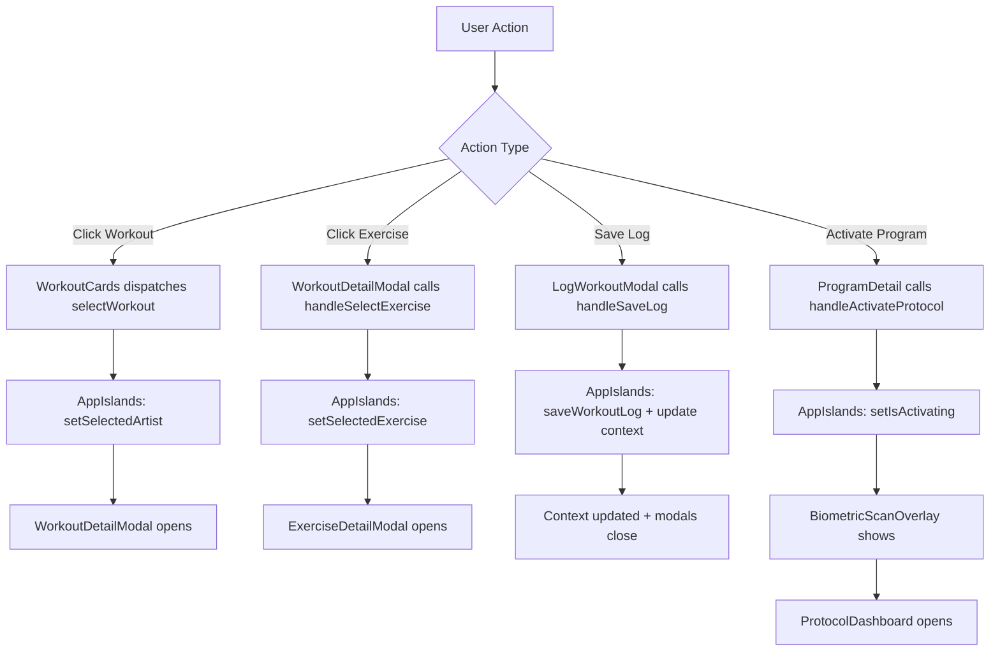

# Component State Management

## Overview

While `AppContext` handles global state, individual components manage local state for UI interactions, modals, and component-specific data. `AppIslands` acts as the central coordinator for modal state and cross-component communication.

## State Coordinator: AppIslands

**Location**: `src/components/react/AppIslands.tsx`

**Purpose**: Manages all modal states and coordinates communication between React islands

### Local State in AppIslands

```tsx
// Modal visibility states
const [showAuthModal, setShowAuthModal] = useState(false);
const [showDashboard, setShowDashboard] = useState(false);
const [showLogModal, setShowLogModal] = useState(false);
const [showProgramsGrid, setShowProgramsGrid] = useState(false);

// Selected items
const [selectedArtist, setSelectedArtist] = useState<Artist | null>(null);
const [selectedProgram, setSelectedProgram] = useState<Program | null>(null);
const [selectedExercise, setSelectedExercise] = useState<Exercise | null>(null);

// Activation state
const [isActivating, setIsActivating] = useState(false);
```

### Global State Access

`AppIslands` uses `useAppContext()` for global state:

```tsx
const {
  user,
  profile,
  workoutLogs,
  setWorkoutLogs,
  completedWorkouts,
  setCompletedWorkouts,
  handleLogout,
} = useAppContext();
```

## Event-Driven Communication

React islands communicate via **custom DOM events** since they're isolated components.

### Event Types

#### `selectWorkout`

**Dispatched by**: `WorkoutCards`, `ProtocolDashboard`

**Listened by**: `AppIslands`

**Payload**: `Artist` object

**Usage**:

```tsx
// Dispatch
const event = new CustomEvent('selectWorkout', {
  detail: workout,
  bubbles: true,
});
window.dispatchEvent(event);

// Listen (in AppIslands)
useEffect(() => {
  const handleSelectWorkout = (e: Event) => {
    const customEvent = e as CustomEvent<Artist>;
    setSelectedArtist(customEvent.detail);
  };
  window.addEventListener('selectWorkout', handleSelectWorkout);
  return () => window.removeEventListener('selectWorkout', handleSelectWorkout);
}, []);
```

#### `showAuthModal`

**Dispatched by**: Various components needing authentication

**Listened by**: `AppIslands`

**Usage**:

```tsx
window.dispatchEvent(new CustomEvent('showAuthModal'));
```

#### `showPrograms`

**Dispatched by**: `ProgramsButton`

**Listened by**: `AppIslands`

**Usage**:

```tsx
window.dispatchEvent(new CustomEvent('showPrograms'));
```

## Modal State Management Pattern

### Opening Modals

Modals are controlled by boolean state in `AppIslands`:

```tsx
// Open modal
setShowAuthModal(true);

// Close modal
setShowAuthModal(false);
```

### Modal Props Pattern

Modals receive state and callbacks:

```tsx
<WorkoutDetailModal
  workout={selectedArtist} // State: selected item
  onClose={() => setSelectedArtist(null)} // Callback: close
  onLogWorkout={() => setShowLogModal(true)} // Callback: action
  onSelectExercise={handleSelectExercise} // Callback: nested action
/>
```

### Keyboard Navigation

`AppIslands` handles Escape key for all modals:

```tsx
useEffect(() => {
  const handleKeyDown = (e: KeyboardEvent) => {
    if (selectedExercise && e.key === 'Escape') {
      setSelectedExercise(null);
      return;
    }
    if (showAuthModal && e.key === 'Escape') setShowAuthModal(false);
    if (showLogModal && e.key === 'Escape') setShowLogModal(false);
    // ... other modals
  };
  window.addEventListener('keydown', handleKeyDown);
  return () => window.removeEventListener('keydown', handleKeyDown);
}, [
  selectedArtist,
  showProgramsGrid,
  selectedProgram,
  showDashboard,
  showLogModal,
  showAuthModal,
  selectedExercise,
]);
```

## Handler Functions

### `handleSelectExercise(exerciseName: string)`

Opens exercise detail modal:

```tsx
const handleSelectExercise = (exerciseName: string) => {
  const exercise = getExerciseDetails(exerciseName);
  if (exercise) {
    setSelectedExercise(exercise);
  }
};
```

**Called by**: `WorkoutDetailModal` when exercise card is clicked

### `handleSaveLog(log: Omit<WorkoutLog, 'id'>)`

Saves workout log and updates context:

```tsx
const handleSaveLog = async (log: Omit<WorkoutLog, 'id'>) => {
  if (!user) return;

  const newLog = { ...log, userId: user.uid };
  const docId = await saveWorkoutLog(newLog);
  const logWithId: WorkoutLog = { id: docId, ...newLog };

  // Update context
  setWorkoutLogs([logWithId, ...workoutLogs]);
  setCompletedWorkouts(
    new Set([...Array.from(workoutLogs.map((l) => l.workoutId || '')), log.workoutId || ''])
  );

  // Close modals
  setShowLogModal(false);
  setSelectedArtist(null);
};
```

**Called by**: `LogWorkoutModal` on form submit

### `handleActivateProtocol()`

Activates a program with biometric scan animation:

```tsx
const handleActivateProtocol = () => {
  if (!user) {
    setShowAuthModal(true);
    return;
  }
  setIsActivating(true);
  setTimeout(() => {
    setIsActivating(false);
    setShowDashboard(true);
    setSelectedProgram(null);
    setShowProgramsGrid(false);
  }, 4000);
};
```

**Called by**: `ProgramDetail` when user activates a program

## State Flow Diagram



## Component-Specific State

### Navigation Component

Manages mobile menu state:

```tsx
const [mobileMenuOpen, setMobileMenuOpen] = useState(false);
```

### LogWorkoutModal

Manages form state internally:

```tsx
const [effortValue, setEffortValue] = useState(5);
const [ratingValue, setRatingValue] = useState(3);
const [notesValue, setNotesValue] = useState('');
```

### ProtocolDashboard

Manages week selection:

```tsx
const [selectedWeek, setSelectedWeek] = useState(1);
const [checkedIn, setCheckedIn] = useState(false);
```

## Best Practices

1. **Centralize modal state** - Keep all modal visibility in `AppIslands`
2. **Use events for cross-island communication** - Islands can't share props directly
3. **Close modals on action** - Always close modals after completing actions
4. **Update context after mutations** - Keep global state in sync
5. **Handle keyboard navigation** - Support Escape key for all modals
6. **Check user state** - Verify authentication before actions requiring it

## Related Documentation

- [App Context](./app-context.md)
- [AppIslands Component](../components/react-components.md#appislandstsx)
- [Integration Patterns](../patterns/integration-patterns.md)
