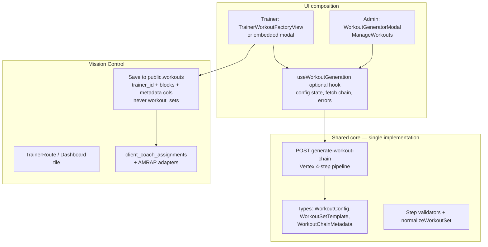

# Technical Design (v1): Workout Factory in Mission Control

**Status:** Draft — v1 design; implementation not started.  
**Related:** [generate-workout-modal-and-prompt.md](../apps/app/docs/features/workouts/generate-workout-modal-and-prompt.md) (admin Workout Factory spec), [`generate-workout-chain.ts`](../apps/app/src/pages/api/ai/generate-workout-chain.ts) (4-step chain), [PERFORMANCE_LAB_TDD.md](./PERFORMANCE_LAB_TDD.md) (Mission Control client shell), [TRAINER_LIVE_AMRAP_WORKOUT_PICKER_TDD.md](./TRAINER_LIVE_AMRAP_WORKOUT_PICKER_TDD.md) (Trainer Live AMRAP picker + `create_session` contract), [TRAINER_VIDEO_SESSION_TDD.md](./TRAINER_VIDEO_SESSION_TDD.md) (Trainer Live host).

---

## 1. Purpose

Bring **Workout Factory** (AI-generated workout sets from the same 4-step chain: Workout Architect → Biomechanist → Coach → Workout Mathematician) into **Mission Control** so a **trainer** can:

1. **Generate** custom workouts for their coaching context without using the admin-only **Manage Workouts** surface.
2. **Assign** a generated workout to **one client**, **multiple clients**, or (product permitting) a **class / cohort** (group).
3. **Reuse** the same workout as a **trainer-curated list** inside the **AMRAP** interval wrapper during a **Trainer Live** session (see §7).

The **factory** must stay **one reusable capability**: shared generation pipeline, shared types, and composable UI—not a forked “trainer-only” generator.

### 1.1 Two intents, one pipeline (why the data models diverge)

| Intent | Owner | Purpose | Canonical storage |
|--------|--------|---------|-------------------|
| **Catalog / SEO** | Admin | Generalized, **public-facing** content for marketing and top-of-funnel | **`workout_sets`** (published rows feed the public SEO / library surfaces) |
| **Bespoke coaching** | Trainer | **Private**, client-specific programming (paying client or exclusive cohort) | **`public.workouts`** scoped by **`trainer_id`** — **never** mixed into `workout_sets` |

Mixing trainer-private titles (e.g. rehab notes) into the **`workout_sets`** pool risks accidental exposure on public homepages. **Mission Control saves must not insert trainer bespoke output into `workout_sets`.** The AI steps are shared; **persistence paths are not.**

---

## 2. Goals and non-goals

### Goals

| ID | Goal |
|----|------|
| **G1** | **Single chain:** Trainer flows call the **same** `/api/ai/generate-workout-chain` (or a thin trainer wrapper that delegates to it) with the same `WorkoutPersona` / validation stack. |
| **G2** | **Composable UI:** Extract or wrap the existing admin modal (`WorkoutGeneratorModal`) so Mission Control can embed **config → generating → preview → save** with trainer-specific copy, defaults, and post-save actions. |
| **G3** | **Trainer ownership & isolation:** Trainer saves land in **`workouts`** (trainer-scoped), not in **`workout_sets`**, so bespoke content cannot leak into the public catalog. |
| **G4** | **Assignments:** Generated workouts can feed **existing or extended** Mission Control assignment flows (see §6). |
| **G5** | **Live AMRAP:** Trainer can pick from **saved `workouts` rows** (AI-generated or manual) when starting AMRAP in Trainer Live, consistent with [TRAINER_LIVE_AMRAP_WORKOUT_PICKER_TDD.md](./TRAINER_LIVE_AMRAP_WORKOUT_PICKER_TDD.md). |

### Non-goals (v1)

| ID | Non-goal |
|----|----------|
| **N1** | Replacing the **admin** Workout Factory UI entirely — admin may keep **Manage Workouts** for catalog curation. |
| **N2** | End-clients generating workouts themselves (audience expansion **beyond** trainer-staff remains a follow-on). |
| **N3** | Full **group / class** data model if none exists — v1 may **batch** single-client assignment UX; explicit cohort tables are an extension (§6.3). |
| **N4** | Changing **AMRAP**’s wire format (`p_workout_list` as JSON array of **strings**) — we **adapt** factory output **to** that contract (§7). |

---

## 3. Current state (codebase anchors)

| Area | Today | Implication |
|------|--------|-------------|
| **AI chain** | [`POST` `apps/app/src/pages/api/ai/generate-workout-chain.ts`](../apps/app/src/pages/api/ai/generate-workout-chain.ts) | Reuse as-is; optionally add **trainer-only** route that sets logging context or rate limits. |
| **Admin UI** | [`WorkoutGeneratorModal.tsx`](../apps/app/src/components/react/admin/WorkoutGeneratorModal.tsx), Manage Workouts | Refactor into **shell + props** (`mode: 'admin' \| 'trainer'`) or headless hook + two thin shells. |
| **Persistence** | `public.workout_sets` — admin **catalog / SEO**; `public.workouts` — **trainer-owned** workouts (`trainer_id`, `blocks` jsonb, etc. per [initial schema](../apps/app/supabase/migrations/00001_initial_schema.sql)) | Trainer Mission Control **must persist to `workouts` only** (§6). |
| **Trainer “workouts” list** | [`GET /api/trainer/workouts`](../apps/app/src/pages/api/trainer/workouts/index.ts) reads `public.workouts` where `trainer_id = uid` | This is the **correct** library for assignments and AMRAP pickers once AI output is saved here. |
| **Assignments** | `client_coach_assignments` (`assignment_type` includes `'workout'`, `resource_id` → `workouts.id`) | **No change required** to assignment type when the canonical trainer artifact is a **`workouts` row** (§6.2). |
| **Mission Control shell** | [`TrainerRoute.tsx`](../apps/app/src/components/react/trainer/TrainerRoute.tsx), [`TrainerDashboard.tsx`](../apps/app/src/components/react/trainer/TrainerDashboard.tsx) (“Programming” currently links to **admin** builder) | Add **Workout Factory** entry (nav card + optional sidebar item). |
| **Client Workouts** | Route **`/trainer/workouts`** ([`TrainerClientWorkoutsView.tsx`](../apps/app/src/components/react/trainer/views/TrainerClientWorkoutsView.tsx)), data from [`GET /api/trainer/workouts/client-overview`](../apps/app/src/pages/api/trainer/workouts/client-overview.ts) | Lists trainer **`public.workouts`** rows with **`client_coach_assignments`** (`assignment_type = 'workout'`, `resource_id` → workout id) for assignee names; supports assigning from the roster without N+1 client fetches. |
| **Library edit & versions** | **`/trainer/workouts/:id/edit`** ([`TrainerLibraryWorkoutEditView.tsx`](../apps/app/src/components/react/trainer/views/TrainerLibraryWorkoutEditView.tsx)); APIs [`GET/PATCH /api/trainer/workouts/[id]`](../apps/app/src/pages/api/trainer/workouts/[workoutId]/index.ts), [`GET .../by-lineage/[lineageId]`](../apps/app/src/pages/api/trainer/workouts/by-lineage/[lineageId].ts), [`POST .../[id]/fork`](../apps/app/src/pages/api/trainer/workouts/[workoutId]/fork.ts)); migration [`20260404120002_workouts_lineage_versioning.sql`](../apps/app/supabase/migrations/20260404120002_workouts_lineage_versioning.sql) | `public.workouts` has **`lineage_id`**, **`version_index`**, **`supersedes_workout_id`**. Trainers can **update in place**, **save as new version** (same lineage, new row), or **save as new workout** (new lineage). Assignments stay tied to the **`workouts.id`** they were created with until the trainer assigns a different row. |
| **Trainer Live AMRAP** | [`TrainerLiveAmrapWrapper.tsx`](../apps/app/src/lib/trainer-live/wrappers/amrap/TrainerLiveAmrapWrapper.tsx), attach RPC + workout picker TDD | Custom lists must resolve to **`string[]` + duration** at attach time. |

---

## 4. User scenarios (v1)

### 4.1 Generate and save (trainer)

1. From Mission Control, trainer opens **Workout Factory** at **`/trainer/workouts/factory`** (or from the dashboard tile).
2. Fills the same conceptual form as today (persona, equipment, block/HIIT options) — **trainer guardrails** on copy (§8).
3. Runs generation; reviews preview; **saves** to their library.

**Outcome:** A durable **`workouts`** row under their **`trainer_id`**, suitable for assignment and Live reuse—**not** a `workout_sets` catalog entry.

### 4.2 Assign to one client

1. From **Roster → client** (existing Mission Control client shell) or from a post-save **Assign** action, trainer picks **one or more** saved factory workouts and confirms.
2. System creates `client_coach_assignments` rows (and any parallel `user_programs` / notifications — **unchanged** unless product extends).

**Outcome:** Client sees assignment in existing HUD / Performance Lab patterns.

### 4.3 Assign to many clients (“class”)

**v1 options (pick one product direction):**

- **4.3a Multi-select roster:** Same as 4.2 but UI selects **N** clients; server loops with idempotent rules (skip duplicates, handle partial failures).
- **4.3b Tag/cohort (later):** Introduce `trainer_roster_groups` (or reuse an existing concept if added elsewhere) and assign to **group** in one transaction.

This TDD does **not** mandate 4.3b for v1.

### 4.4 Trainer Live — AMRAP custom list

1. Trainer starts Trainer Live, opens **Start AMRAP** flow ([TRAINER_LIVE_AMRAP_WORKOUT_PICKER_TDD.md](./TRAINER_LIVE_AMRAP_WORKOUT_PICKER_TDD.md)).
2. Besides presets / build-your-own, trainer selects **Saved workouts** (AI-generated rows in **`workouts`**) and picks a workout or **session slice** mapped to exercise names.
3. UI maps selection to `p_workout_list: string[]` and `p_duration_minutes` (§7), then calls attach RPC.

---

## 5. Reusable Workout Factory architecture

### 5.1 Layers

### 5.2 UI strategy (decision for implementation)

| Approach | Description |
|----------|-------------|
| **Recommended** | Extract **state + API calls** from `WorkoutGeneratorModal` into a hook (e.g. `useWorkoutFactoryGeneration`). Keep presentational sections as shared components. Admin and Mission Control pass **different** titles, subtitles, **persistence targets** (`workout_sets` + publish-to-internet vs `workouts` + assign-to-client), and **status semantics** (§6.3). |
| **Alternative** | Single modal component with `variant="admin" \| "trainer"` controlling strings, navigation, and which persistence function runs. |

Either way, **no second copy** of the 4-step chain or step validators.

**Route:** Trainer shell lives at **`/trainer/workouts/factory`** (§12.2).

### 5.3 API surface

| Endpoint | Role |
|----------|------|
| **Existing** `POST /api/ai/generate-workout-chain` | Primary entry; same body as admin. |
| **Optional** `POST /api/trainer/workout-factory/generate` | Thin proxy: verifies Mission Control staff (`verifyRosterAccessRequest` or trainer role), forwards to shared handler, adds **audit log** / rate limit key = `trainer:{uid}`. |

**Rule:** Generation **must not** require admin-only auth if the trainer is the intended user; today’s chain should be callable by any authenticated user **or** explicitly allow trainer role—**confirm** current route guards and adjust so trainers do not need `/admin` session.

---

## 6. Data model and assignments

### 6.1 Admin catalog: `workout_sets` only

- **Use:** SEO / generalized library; **`status = 'published'`** means **visible on public marketing surfaces** (internet), not “assigned to a client.”
- **Do not** route Mission Control trainer saves here.

### 6.2 Verdict: Option A — persist trainer AI output to `public.workouts` (the “bridge,” single destination)

**Decision:** The same Vertex chain runs for admin and trainer, but **after** validation/normalization the Mission Control path **writes only to `public.workouts`**:

- **`trainer_id`** = authenticated trainer (`auth.uid()`).
- **Content:** Map `WorkoutSetTemplate` / session data into existing **`blocks`** (and related columns). **Provenance columns** (`source`, `ai_chain_metadata`, visibility) are **required** — see §12.3 and migration note below.
- **`client_coach_assignments`** continues to use **`assignment_type = 'workout'`** and **`resource_id` → `workouts.id`** with no new assignment enum value ([`fetchTitleAndValidateResource`](../apps/app/src/lib/supabase/admin/trainer-client-assignments.ts) already validates `trainer_id`).

**Why not Option B (`workout_set` assignments)?** Pointing assignments at **`workout_sets`** would either mix private titles into the catalog table or require a parallel private subtree in that table—both are riskier than using the **trainer-scoped `workouts`** table that assignments already expect.

**Why not duplicate into both tables?** Avoid syncing **two** rows (`workout_sets` + `workouts`); **one** canonical row per bespoke workout keeps “John’s rehab week 2” out of the public pool entirely.

### 6.3 Draft vs. published — two different meanings (resolved)

| Surface | “Draft” | “Published” |
|---------|---------|-------------|
| **Admin `workout_sets`** | Not yet on the marketing site | **Live on the public internet** (SEO / catalog) |
| **Trainer `workouts`** | Generated or edited; **not yet assigned** to a client | **Delivered to the client** (via assignment and/or their HUD) — **not** “on the internet” |

**Product rule:** Trainer UI must **never** reuse admin copy that implies “Publish to the web.” Use language such as **“Assign”**, **“Send to client”**, or **“Mark ready to assign.”** The **`visibility`** column (and related flags) on **`public.workouts`** encodes **private lifecycle**, distinct from `workout_sets.status` (see §12.3).

### 6.4 Group assignment

- If **no** group table exists: implement **4.3a** (multi-select clients) only.
- If product adds **cohorts** later: add `trainer_cohort_id` on assignment or a join table; **out of scope** for v1 unless schema already exists.

---

## 7. AMRAP wrapper: mapping factory → `create_session`

AMRAP expects **`p_workout_list`**: JSON array of **exercise name strings** and **`p_duration_minutes`** ([TRAINER_LIVE_AMRAP_WORKOUT_PICKER_TDD.md](./TRAINER_LIVE_AMRAP_WORKOUT_PICKER_TDD.md), `create_session`).

**Full fidelity vs. attach contract:** AI output (including **HIIT / timer schema**) is **saved in full fidelity** in **`public.workouts`** (`blocks` + **`ai_chain_metadata`**) so **future interval shells** (Tabata, EMOM, etc.) can consume rich session data without re-generation. **v1** does not change that RPC contract: the AMRAP picker uses a **dedicated client-side adapter** that maps the rich session data into the flat **`string[]`** (and duration) required by the current **`trainer_live_attach_amrap_session` → `create_session`** path.

**Mapping rules (v1 — AMRAP only):**

1. **Session selection:** Trainer picks a **saved `workouts`** row (or one logical session slice within **`blocks`**) produced by the same mapper used at save time.
2. **Name extraction:** The **adapter** flattens ordered exercises from **`blocks`** (and/or metadata) to **display names** for the attach RPC — reuse or extend existing mappers as needed for HIIT vs. strength blocks.
3. **Duration:** Use `duration_minutes` on the row, HIIT-derived totals, or prompt the trainer to **confirm/edit** before attach when the live block should differ.
4. **Empty / invalid:** Reject with UI error if flattened list is empty (align with non-empty **DB** validation on attach RPC).

**UX:** Extend the shared **workout picker** package so a **“My workouts” / AI-saved** source lists **`public.workouts` for `trainer_id`** (titles + metadata, filterable by **`source`** — §12.3); drilling in previews **blocks** then confirm. **Do not** source this list from **`workout_sets`**.

---

## 8. Guardrails (trainer vs admin)

| Concern | Mitigation |
|---------|------------|
| **Medical / injury text** | Show standard disclaimer; optional stricter **required acknowledgment** checkbox for trainer mode before first generate in a session. |
| **AI safety** | Reuse validation; consider **shorter preview** for clients if assignments embed descriptions. |
| **Rate limits** | Per-trainer daily generation cap (config + soft 429). |
| **Cost** | Log `trainer_user_id` on optional proxy route for Vertex usage analytics. |
| **Catalog leakage** | Trainer flow **never** writes bespoke content to **`workout_sets`**; public SEO queries remain **admin-curated catalog only** (§1.1, §6). |

---

## 9. Mission Control navigation and placement

| Location | Proposal |
|----------|----------|
| **Dashboard** | Replace or complement “Open Builder” on **Programming** card with **Workout Factory** primary CTA linking to **`/trainer/workouts/factory`** (canonical — §12.2). |
| **Sidebar** | Optional nav item under Mission Control: **Workout Factory** → same path (icon aligned with admin `LayoutList`). |
| **Admin link** | Keep secondary “Advanced / Admin builder” if trainers still need Program Factory in admin. |

Routes live under existing [`TrainerRoute`](../apps/app/src/components/react/trainer/TrainerRoute.tsx) `BrowserRouter` base (`/trainer/...`). Nesting under **`/workouts`** signals that the Factory is a **creation tool for the trainer’s existing library** (`public.workouts`), not a disconnected top-level feature.

---

## 10. Security

- **Auth:** Reuse `verifyRosterAccessRequest` / trainer Mission Control checks consistent with [`/api/trainer/*`](../apps/app/src/pages/api/trainer/workouts/index.ts) patterns.
- **RLS:** Trainer reads/writes only **own** `workouts` rows (`trainer_id`); extend policies if new provenance columns are added. **`workout_sets`** remains **admin/catalog** usage for the SEO pipeline—the **Mission Control trainer factory flow** does not `INSERT` into `workout_sets` (admin tools may still do so for catalog work).
- **Privacy:** “Published” for trainers means **visible to assigned clients**, not public HTML. No trainer bespoke row should appear in **anonymous** or **SEO** queries that power the marketing site.

---

## 11. Phasing

| Phase | Scope |
|-------|--------|
| **P0** | Auth’d trainer can open Factory UI at **`/trainer/workouts/factory`**, run chain, **persist to `public.workouts`** (mapper + **migration** for `source`, `ai_chain_metadata`, `visibility` — §12.3). |
| **P1** | Assign to **one** client using existing **`workout`** assignments (§6.2). |
| **P2** | Multi-client assign + Live AMRAP **saved workouts** tab + mapping (§7). |
| **P3** | Cohort/group model if needed; analytics. |

---

## 12. Resolved decisions (formerly open questions)

### 12.1 HIIT / timer schema vs. embedded AMRAP (Q1)

**Question:** Confirm flattening rules vs Tabata/EMOM expectations in embedded AMRAP.

**Resolution:** AI output is **stored in full fidelity** (including timer / HIIT structure) so **future interval shells** (Tabata, EMOM, etc.) can use the same rows without lossy downgrades. For **v1**, the **AMRAP** picker alone uses a **dedicated client-side adapter** that maps rich session data into the flat **`string[]`** (and duration) required by the **current** AMRAP attach RPC. Tabata/EMOM-specific shells are **not** blocked by v1 AMRAP string-list semantics.

### 12.2 Canonical route (Q2)

**Question:** `/trainer/workout-factory` vs `/trainer/workouts/factory`.

**Resolution:** **`/trainer/workouts/factory`** is canonical. Because the Factory persists into **`public.workouts`**, placing the route under **`/workouts`** reinforces the mental model: **Workout Factory is a creation tool that feeds the trainer’s existing library**, not a separate top-level product island.

### 12.3 Schema: explicit columns on `public.workouts` (Q3)

**Question:** Embed metadata in **`blocks`** vs add columns.

**Resolution:** Run a **lightweight migration** on **`public.workouts`** to add at least:

| Column | Purpose |
|--------|---------|
| **`source`** | e.g. `'ai_factory'` vs manual — enables **filtering** (“AI Generated” vs “Manually Authored”) without JSON parsing |
| **`ai_chain_metadata`** | `JSONB` — full chain outputs / audit / re-hydration for future shells |
| **`visibility`** (or equivalent) | Maps **private lifecycle** (draft vs ready-to-assign vs client-visible — see §6.3) |

Packing metadata only into **`blocks`** would be slightly faster to ship today; **explicit columns** are required for **cheap queries and indexes** (library filters, analytics, support) without scanning or parsing **`blocks`** JSON.

---

**Also resolved (see §6.3):** Trainer **draft / published** means **not assigned → assigned to client**, not web visibility. **Assignments** stay on **`workouts.id`**; HUD paths that already consume `workout` assignments remain aligned.

---

## 13. Documentation cross-links

On implementation, update:

- [COMMANDS.md](./COMMANDS.md) — if new migrations or typegen.
- [TRAINER_LIVE_AMRAP_WORKOUT_PICKER_TDD.md](./TRAINER_LIVE_AMRAP_WORKOUT_PICKER_TDD.md) — **P2:** see §5.4 (Mission Control saved workouts tab + mapping).
- Admin [generate-workout-modal-and-prompt.md](../apps/app/docs/features/workouts/generate-workout-modal-and-prompt.md) — note shared hook / trainer entry points.

---

*End of v1 TDD.*
