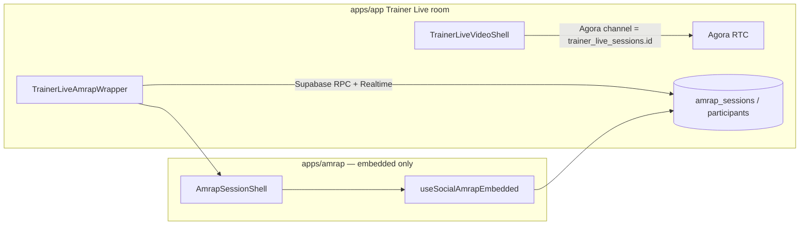

# Technical Design: Trainer Live — AMRAP interval wrapper

**Status:** Design — **not implemented**; implements the **`amrap`** branch of [TRAINER_LIVE_INTERVAL_WRAPPERS_TDD.md](./TRAINER_LIVE_INTERVAL_WRAPPERS_TDD.md).  
**Parent:** [TRAINER_LIVE_INTERVAL_WRAPPERS_TDD.md](./TRAINER_LIVE_INTERVAL_WRAPPERS_TDD.md) (approved Option A, registry, session-first flow, no default timer).  
**Related:** [TRAINER_VIDEO_SESSION_TDD.md](./TRAINER_VIDEO_SESSION_TDD.md), [TRAINER_LIVE_P3_PROTOCOL_SYNC_TDD.md](./TRAINER_LIVE_P3_PROTOCOL_SYNC_TDD.md) (out of scope here), [ROADMAP_AMRAP_VIDEO_INTEGRATION.md](./ROADMAP_AMRAP_VIDEO_INTEGRATION.md), `apps/amrap` ([`AmrapSessionShell`](../apps/amrap/src/components/amrap-session/AmrapSessionShell.tsx), [`useSocialAmrap`](../apps/amrap/src/hooks/useSocialAmrap.tsx), [`AmrapSessionPage`](../apps/amrap/src/pages/AmrapSessionPage.tsx)), `apps/app` ([`TrainerLiveVideoShell`](../apps/app/src/components/react/trainer/live/TrainerLiveVideoShell.tsx), [`useTrainerLiveAgoraChannel`](../apps/app/src/hooks/useTrainerLiveAgoraChannel.ts)).

---

## 1. Purpose

Deliver the **`interval_wrapper_kind = 'amrap'`** experience inside Mission Control: when the trainer selects **AMRAP** in the interval sidebar, participants see **AMRAP With Friends** session UI (timer, rounds, leaderboard, workout list) **next to** the existing Trainer Live **video grid**, using **one** Agora channel (`trainer_live_sessions.id`).

This document is the **implementation spec** for that slice only: linking `amrap_sessions` to Trainer Live, decoupling AMRAP’s engine from AMRAP’s Agora stack, participant mapping, RPCs, UI, security, and tests. **Generic wrapper registry** and **`simple_countdown`** are specified in the parent doc.

---

## 2. Goals and non-goals

### Goals

| ID | Goal |
|----|------|
| **AG1** | **Single video channel:** All users join Agora only as `trainer_live_participants` on `trainer_live_sessions.id`; AMRAP code path **must not** call [`useAgoraChannel`](../apps/amrap/src/hooks/useAgoraChannel.ts) with `amrap_sessions.id` when embedded. |
| **AG2** | **Parity of workout state:** Timer phase, rounds, `update_session_state` behavior, and Realtime subscriptions match **social AMRAP** ([`useSocialAmrap`](../apps/amrap/src/hooks/useSocialAmrap.tsx)) for the linked `amrap_session_id`. |
| **AG3** | **Trainer creates/links AMRAP** when switching to this wrapper (or first entering it): persist `amrap_session_id` in `interval_wrapper_config` per parent §5.1. |
| **AG4** | **Clients** join AMRAP participant rows **from** the Trainer Live join context (same tab, `/trainer/live/join/:id`), without navigating to `/amrap/with-friends/session/:id` for the happy path. |
| **AG5** | **Foundational pattern:** Code structure (wrapper component, config typing, error boundaries, analytics hooks) is the **template** for future interval wrappers. |

### Non-goals

| ID | Non-goal |
|----|----------|
| **AN1** | Changing AMRAP **seat** or **round** product rules beyond what’s required to embed. |
| **AN2** | **iframe** production path (parent N3). |
| **AN3** | Unifying `amrap_participants.id` with `trainer_live_participants.id` (optional optimization only). |
| **AN4** | P3 `trainer_live_session_state` — AMRAP continues to use **`amrap_sessions`** + existing RPCs. |

---

## 3. User flows

### 3.1 Trainer (host)

1. Creates Trainer Live session with `shell = 'countdown_timer'` (sidebar visible); `interval_wrapper_kind = 'none'`.  
2. Opens in-room **interval picker** → **AMRAP**.  
3. System runs **attach** path: create or reuse `amrap_sessions`, set `interval_wrapper_kind = 'amrap'`, `interval_wrapper_config = { "amrap_session_id": "<uuid>" }`.  
4. Sidebar renders **`TrainerLiveAmrapWrapper`**; video column unchanged.  
5. Trainer operates session like **AmrapSessionPage** host (start setup, timer, log rounds) via `AmrapSessionShell`.  
6. Optional: switch to `none` or `simple_countdown` — **product rule** for in-progress AMRAP (confirm discard vs soft-pause) decided at implementation time (parent §5.3).

### 3.2 Client

1. Joins via `/trainer/live/join/:trainerLiveSessionId` as today.  
2. When `interval_wrapper_kind === 'amrap'`, sidebar shows client AMRAP UI (read-only controls per AMRAP rules).  
3. On first need to interact with AMRAP state, ensure **AMRAP participant row** exists (join RPC or lazy join) using identity mapping (§6).  
4. Video remains **TrainerLiveVideoShell** only.

### 3.3 Optional deep link

- **“Open in AMRAP app”** link to `/amrap/with-friends/session/:amrapSessionId` for support/debug — clearly labeled; not required for MVP.

---

## 4. Architecture



**Invariant:** No edge from `ENG` to **AMRAP-scoped** Agora channel in embedded mode.

### 4.1 Component ownership

| Layer | Owns |
|-------|------|
| [`TrainerLiveSessionRoom`](../apps/app/src/components/react/trainer/live/TrainerLiveSessionRoom.tsx) | Layout split, passes props into registry → `TrainerLiveAmrapWrapper`. |
| **`TrainerLiveAmrapWrapper`** (new) | Parse `wrapperConfig`, ensure participant mapping triggers, mount `AmrapSessionShell` + embedded hook, theming wrapper, error surface to parent banner. |
| **`useSocialAmrapEmbedded`** (new or refactored from `useSocialAmrap`) | All logic currently in `useSocialAmrap` **except** `useAgoraChannel` when `embedVideo: 'trainer_live'`. |
| [`AmrapSessionShell`](../apps/amrap/src/components/amrap-session/AmrapSessionShell.tsx) | Presentational; may receive **slots** to hide video toggles already provided by Trainer Live (product copy). |

---

## 5. Data model (AMRAP-specific)

### 5.1 `interval_wrapper_config` shape for `amrap`

```json
{
  "amrap_session_id": "<uuid>"
}
```

- **Validation:** App + RPC must ensure UUID format and that the row exists (or is created in same txn as attach).  
- **No secrets** in JSON (parent §8).

### 5.2 Linking `amrap_sessions` to Trainer Live

**Option 1 — Column on `amrap_sessions` (recommended if AMRAP team owns schema):**

| Column | Type | Notes |
|--------|------|--------|
| `trainer_live_session_id` | `uuid` NULL FK → `trainer_live_sessions(id)` ON DELETE SET NULL | Set when session is created from Trainer Live; unique partial index **one active link per trainer live session** if product requires. |

**Option 2 — Config only:** Only `interval_wrapper_config.amrap_session_id` on Trainer Live; no AMRAP column. Harder to query “all AMRAP sessions spawned from Mission Control.”

**Recommendation:** Add **`trainer_live_session_id`** on `amrap_sessions` if migrations can touch AMRAP tables; else document reverse lookup by scanning config (not ideal).

### 5.3 Attach RPC (sketch)

**`trainer_live_attach_amrap_session(p_trainer_live_session_id uuid, p_duration_minutes int, p_workout_list jsonb)`** — `SECURITY DEFINER`, caller must be `trainer_user_id` on the Trainer Live session. **Implemented** in [`20260430231000_trainer_live_attach_amrap_workout_params.sql`](../supabase/migrations/20260430231000_trainer_live_attach_amrap_workout_params.sql); UX and client flow: [TRAINER_LIVE_AMRAP_WORKOUT_PICKER_TDD.md](./TRAINER_LIVE_AMRAP_WORKOUT_PICKER_TDD.md).

1. Assert `shell = 'countdown_timer'` (or allow from `video_only` and imply enabling sidebar — **product**; default: require sidebar shell).  
2. Insert **`amrap_sessions`** row via **`create_session(p_duration_minutes, host_display, p_workout_list, …)`** — duration and workout list are **required** (non-empty exercise array).  
3. Set `trainer_live_sessions.interval_wrapper_kind = 'amrap'`, `interval_wrapper_config = { amrap_session_id }`.  
4. Optionally insert **trainer’s** `amrap_participants` row if social AMRAP expects host participant before clients join.  
5. Return `{ amrap_session_id, host_token, amrap_participant_id, … }`.

**Idempotency:** If `interval_wrapper_kind` is already `amrap` and config has same session, no-op or validate match.

**Switch away:** Separate RPC or `trainer_live_set_interval_wrapper` branch ends/soft-ends AMRAP per product (parent §5.3).

---

## 6. Engine decoupling (implementation phases)

### 6.1 Problem

[`useSocialAmrap`](../apps/amrap/src/hooks/useSocialAmrap.tsx) composes session state with **Agora** tied to **`sessionId`** (= `amrap_sessions.id`). Trainer Live uses a **different** channel id.

### 6.2 Target API (illustrative)

```ts
// apps/amrap — public embed entry
useSocialAmrapEmbedded(options: {
  amrapSessionId: string;
  embedVideo: 'trainer_live'; // does not init useAgoraChannel for AMRAP channel
  // same auth / supabase / participant identity as social path
}): AmrapSessionEngine & { ... }
```

**Behavioral requirements**

- **Subscribe** to `amrap_sessions` / participant / round state exactly as social mode.  
- **Mutations** (host): same RPCs as today.  
- **Omit:** `useAgoraChannel`, `localVideoTrack`, remote user list from AMRAP — or return **null** tracks and let shell hide video chrome.  
- **Slots:** Reuse `AmrapSessionEngine.slots` (see [`useSocialAmrap`](../apps/amrap/src/hooks/useSocialAmrap.tsx) `engineWithSlots`) to strip or replace video UI that duplicates Trainer Live.

### 6.3 Phased work

| Phase | Deliverable |
|-------|-------------|
| **A0** | In `apps/amrap`, internal flag **`skipAgora`** (or `embedVideo`) on `useSocialAmrap`; all tests that assume Agora still pass for non-embed path. |
| **A1** | Export **`useSocialAmrapEmbedded`** + types from `apps/amrap` **or** `packages/` if `apps/app` import graph requires (avoid circular deps). |
| **A2** | `TrainerLiveAmrapWrapper` in `apps/app` wires embedded hook + `AmrapSessionShell`; E2E smoke with two browsers. |
| **A3** | Polish: Mission Control theme tokens, analytics `trackEvent` for `trainer_live_amrap_start` / `round_log` (names TBD; respect `FUNNEL_EVENTS` allowlist per [P4](./TRAINER_LIVE_P4_LONG_SESSION_METRICS_TDD.md) when applicable). |

### 6.4 A1 implementation notes (embedded export)

- **Import path:** `import { useSocialAmrapEmbedded, AmrapAuthProvider, … } from 'amrap/embed'` from [`apps/app`](../apps/app/package.json) with workspace dependency **`"amrap": "*"`**.
- **Package exports:** [`apps/amrap/package.json`](../apps/amrap/package.json) subpath **`./embed`** → [`apps/amrap/src/embed/index.ts`](../apps/amrap/src/embed/index.ts).
- **Vite / `@/`:** The app’s global alias `@` points at `apps/app/src`. Code under `apps/amrap` uses `@/` for its own modules. [`apps/app/astro.config.mjs`](../apps/app/astro.config.mjs) includes a **`amrap-internal-at-alias`** plugin (`enforce: 'pre'`) that resolves `import '@/…'` to `apps/amrap/src/…` when the **importer** path matches `…/amrap/src/…` (including `node_modules/amrap/src/…` via the workspace link). **`ssr.noExternal`** includes **`amrap`** so SSR bundles the workspace package.
- **Auth:** The embedded hook uses `useAmrapAuth`; mount **`AmrapAuthProvider`** (re-exported from `amrap/embed`) above the wrapper (A2).
- **Router:** `useSocialAmrap` uses `react-router-dom` `Link`; Trainer Live should provide a compatible Router or follow up with embed-specific navigation.

---

## 7. Participant identity mapping

| Trainer Live | AMRAP |
|--------------|--------|
| `trainer_live_participants.user_id` | Prefer match `amrap_participants` by `user_id` if AMRAP stores it; else by join RPC nickname flow. |
| `trainer_live_participants.id` | Agora **string** uid for video only; **do not** require equality with `amrap_participants.id`. |

**Algorithm (v1 sketch)**

1. **Trainer:** On attach, create AMRAP host participant consistent with [`AmrapSessionPage`](../apps/amrap/src/pages/AmrapSessionPage.tsx) host bootstrap.  
2. **Authenticated client:** Call existing **join** RPC with profile-derived display name; map `auth.uid()` to one AMRAP participant per `amrap_session_id`.  
3. **Anonymous client:** Mirror [`getStoredGuestClaimToken`](../apps/amrap/src/hooks/useAmrapSession.ts) / guest flows; store claim in `sessionStorage` keyed by `(trainerLiveSessionId, amrapSessionId)` to survive refresh.  
4. **Roster-invited (P1):** Must be signed in; enforce 1:1 participant row to avoid duplicate leaderboard entries.

**Conflict resolution:** If AMRAP join fails, wrapper shows actionable error; video continues to work.

---

## 8. UI / UX (AMRAP-specific)

- **Loading:** Skeleton in sidebar until `amrap_session_id` present **and** engine `loading === false`.  
- **Trainer chrome:** Reuse `AmrapSessionShell` controls; hide AMRAP video buttons; optional one-line hint: “Video is in the main panel.”  
- **Client chrome:** Same as social AMRAP client role; no second camera prompt.  
- **Finished / recap:** Decide: **modal inside sidebar** (narrow) vs **full-screen overlay** vs **link** to AMRAP — document choice in PR; default preference **in-panel minimal recap** + link “View full history in AMRAP” if logged in.  
- **Destructive switch:** If trainer changes wrapper while AMRAP `timerPhase !== 'finished'`, show confirm dialog listing consequences (lost unsaved guest state, etc.).

---

## 9. Security

| Concern | Mitigation |
|---------|------------|
| **Who can attach AMRAP?** | Only `trainer_user_id` on `trainer_live_sessions` via `trainer_live_attach_amrap_session` / `trainer_live_set_interval_wrapper`. |
| **Who can mutate AMRAP state?** | Existing AMRAP RPCs + RLS; host checks unchanged. |
| **Leaking `amrap_session_id`?** | UUID in config; join still requires AMRAP + Trainer Live participation rules; do not expose in public join_hints beyond “kind is amrap” if product wants extra obscurity (optional). |
| **Video tokens** | Unchanged [`trainer_live_verify_token_targets`](../supabase/migrations/20260430116000_trainer_live_rls_hardening.sql) path. |

---

## 10. Realtime and `join_hints`

- **Clients** must observe `interval_wrapper_kind` transitions to `amrap` **without** full page reload: **subscribe** to `trainer_live_sessions` row for `id = trainerLiveSessionId` (Supabase Realtime) **or** poll `trainer_live_session_join_hints` at low interval — **pick one** in implementation and document in [COMMANDS.md](./COMMANDS.md).  
- **`join_hints` extension:** Return at least `{ ..., interval_wrapper_kind, interval_wrapper_config }` (parent §5.1); AMRAP clients need `amrap_session_id` from config once kind is `amrap` (or fetch via follow-up read if hints omit config — prefer including safe fields only).

---

## 11. Testing

| Layer | Test |
|-------|------|
| **Unit** | Parse `interval_wrapper_config` for `amrap`; guard invalid UUID. |
| **Unit** | `useSocialAmrapEmbedded` does not invoke Agora client init (mock/spy). |
| **Integration** | Attach RPC creates `amrap_sessions` + updates Trainer Live row; RLS allows trainer + participants to read AMRAP state. |
| **Manual E2E** | Trainer: pick AMRAP → start timer → client sees same phase; both on video; six-client cap unchanged. |
| **Manual** | Guest client: refresh mid-session, claim token path still works. |
| **Manual** | Switch `amrap` → `none` → `amrap` (new session id) if product allows second AMRAP block in one Trainer Live session. |

---

## 12. Rollout

- **Feature flag** (optional): `PUBLIC_TRAINER_LIVE_AMRAP_WRAPPER` or env-gated picker entry until AMRAP embed is stable.  
- **Docs:** Update [COMMANDS.md](./COMMANDS.md) for dev (both apps running if needed for AMRAP static assets — clarify monorepo dev story).

---

## 13. Open questions (resolve before / during implementation)

1. **`amrap_sessions.trainer_live_session_id`:** Add column vs config-only?  
2. **Switch away from AMRAP mid-workout:** Hard stop vs allow resume if user switches back?  
3. **Recap / PostWorkoutRecapModal:** Which surface in Mission Control chrome?  
4. **Package split:** `apps/amrap` export vs `packages/amrap-embed` for `apps/app` bundle size?  
5. **Analytics:** Event names and payload schema for trainer-live-scoped AMRAP funnels.

---

## 14. Summary

The **AMRAP wrapper** links a standard **social AMRAP** session to Trainer Live via **`interval_wrapper_kind`** and **`interval_wrapper_config.amrap_session_id`**, while **`useSocialAmrapEmbedded`** drives [`AmrapSessionShell`](../apps/amrap/src/components/amrap-session/AmrapSessionShell.tsx) **without** a second Agora channel. **`TrainerLiveAmrapWrapper`** is the **reference implementation** for future interval wrappers; attach and identity rules keep **trainer authority** and **existing AMRAP RLS** intact.
