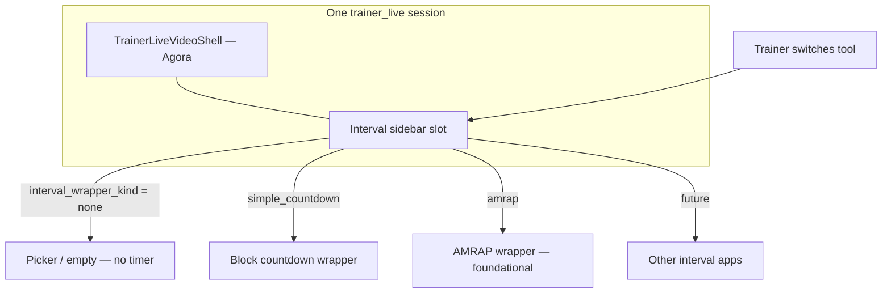

# Technical Design: Trainer Live — Interval timer wrappers (Video + Intervals)

**Status:** **Approved** — Option **A** (§5.1 columns on `trainer_live_sessions`). Implementation pending.  
**Parent:** [TRAINER_VIDEO_SESSION_TDD.md](./TRAINER_VIDEO_SESSION_TDD.md) (P2 `countdown_timer` shell = **layout** with a sidebar; today [`TrainerLiveCountdownPanel`](../apps/app/src/components/react/trainer/live/shells/TrainerLiveCountdownPanel.tsx) is **temporary** until the registry ships).  
**Related:** [TRAINER_LIVE_AMRAP_WRAPPER_TDD.md](./TRAINER_LIVE_AMRAP_WRAPPER_TDD.md) (**`amrap`** wrapper — implementation spec), [TRAINER_LIVE_TABATA_WRAPPER_TDD.md](./TRAINER_LIVE_TABATA_WRAPPER_TDD.md) (**`tabata`** interval wrapper — AMRAP-style embed; design doc), [TRAINER_LIVE_P3_PROTOCOL_SYNC_TDD.md](./TRAINER_LIVE_P3_PROTOCOL_SYNC_TDD.md) (native Tabata/EMOM + `trainer_live_session_state` — **different** from full-app wrappers), [ROADMAP_AMRAP_VIDEO_INTEGRATION.md](./ROADMAP_AMRAP_VIDEO_INTEGRATION.md), `apps/amrap` (`AmrapSessionShell`, `useSocialAmrap`, `amrap_sessions`).

---

## 1. Purpose

**Session-first flow:** The trainer **starts a Trainer Live video session** (same create/join model as today). **Within that one session**, they **choose which interval tool** appears in the sidebar — and may **switch tools over time** (e.g. simple block countdown for a warm-up segment, then AMRAP for the main piece, then another product later) **without** ending the video room or reissuing join links. **One active interval tool at a time** (single sidebar slot); running **multiple interval UIs side-by-side** in the same session is **out of scope** unless product revisits.

**No default timer:** There is **no** automatically mounted countdown or protocol when the session opens. The sidebar may show an **empty / picker** state until the trainer selects a wrapper. **Implementing a default timer is explicitly out of scope** for this design.

**`countdown_timer` (P2 shell) vs interval wrappers:** The DB value `shell = 'countdown_timer'` means **“layout includes the interval sidebar column next to video”** — not “always show the P2 countdown component.” The **active tool** in that column is driven by **`interval_wrapper_kind`** (§5.1). The current [`TrainerLiveCountdownPanel`](../apps/app/src/components/react/trainer/live/shells/TrainerLiveCountdownPanel.tsx) becomes **one registered wrapper** (e.g. `simple_countdown`) alongside AMRAP and future interval apps.

**First shipped wrapper — AMRAP (foundational):** The **AMRAP** wrapper is the **first** full interval implementation and the **reference** for later wrappers: same props contract, registry metadata, embedded-engine pattern (§6), and UX patterns (loading, errors, trainer authority). Subsequent shells (WOD, other timers, etc.) **follow AMRAP’s integration shape**, not ad hoc one-offs.

**Later wrappers:** Other interval apps in the monorepo register the same contract so Mission Control stays a thin host.

---

## 2. Goals and non-goals

### Goals

| ID | Goal |
|----|------|
| **G1** | **Stable wrapper contract** in `apps/app`: props, lifecycle, error boundaries, and a **registry** (`wrapperKind` → component + metadata). **AMRAP is the first implementation** and the **template** for additional kinds. |
| **G2** | **Same video session, multiple tools over time:** Trainer can **change** `interval_wrapper_kind` (and config) **during** the session via trainer-only RPC/UI; clients follow via `join_hints` + Realtime/subscribe (implementation detail). |
| **G3** | **No default timer:** Initial state **`none`** — sidebar shows picker or empty state until the trainer selects a wrapper. |
| **G4** | **AMRAP wrapper (v1):** Linked **`amrap_sessions`** when trainer selects AMRAP; **single video plane** = Trainer Live Agora (not a second channel for the same room). |
| **G5** | **Trainer authority:** Mutations match each product’s rules (e.g. AMRAP host); cross-domain checks use `trainer_live_sessions.trainer_user_id`. |
| **G6** | **Client join story:** Same Trainer Live join link; each wrapper handles in-panel participation (AMRAP participant join, etc.). |
| **G7** | **Simple countdown** as **one registry entry** (P2 panel logic moved behind `simple_countdown`), not the implicit default. |

### Non-goals (initial delivery)

| ID | Non-goal |
|----|----------|
| **N1** | **P3-style generic protocol sync** for arbitrary JSON patches — wrappers may **reuse** AMRAP’s existing tables/RPCs first; native `trainer_live_session_state` Tabata/EMOM remains in [P3 TDD](./TRAINER_LIVE_P3_PROTOCOL_SYNC_TDD.md). |
| **N2** | **Two Agora channels** for one human-visible “room” (trainer_live + amrap channel simultaneously for the same users). |
| **N3** | **iframe** embedding the full AMRAP app as the **long-term** solution (acceptable only as an **explicitly temporary** spike if refactor slips). |
| **N4** | Changing **seat cap** (1 trainer + 6 clients) or token issuance rules. |

---

## 3. Relationship to parent TDD and P3

- **`shell = 'video_only'`:** No interval sidebar; wrappers inactive (kinds ignored or forced `none`).  
- **`shell = 'countdown_timer'`:** Sidebar **column exists**; **content** = registry render for **`interval_wrapper_kind`** (`none` → no timer UI until trainer picks).  
- **P3:** Native Tabata/EMOM via `trainer_live_session_state` remains a **parallel** track; a future wrapper could expose P3 state in the same sidebar slot. This doc does not require P3 for AMRAP.

---

## 4. Wrapper contract (app-level)

### 4.1 Registry

- **Location (proposed):** `apps/app/src/lib/trainer-live/wrappers/`  
  - `types.ts` — shared TypeScript types  
  - `registry.ts` — `Record<TrainerLiveIntervalWrapperKind, WrapperDefinition>`  
  - `amrap/TrainerLiveAmrapWrapper.tsx` — first implementation  

- **`TrainerLiveIntervalWrapperKind` (approved baseline):** `'none' | 'simple_countdown' | 'amrap'` — expand with `'wod_timer' | ...` as products onboard. **`simple_countdown`** = current P2 block timer behavior, **not** the default mount. **`amrap`** = first full “app” wrapper and **reference implementation** for the next shells.

### 4.2 Props passed to every wrapper

All wrappers receive at least:

| Prop | Type | Notes |
|------|------|--------|
| `trainerLiveSessionId` | `string` | UUID; Agora **channel** for video |
| `participantId` | `string` | Caller’s `trainer_live_participants.id` |
| `role` | `'trainer' \| 'client'` | Mirrors [`TrainerLiveVideoShell`](../apps/app/src/components/react/trainer/live/TrainerLiveVideoShell.tsx) |
| `displayName` | `string` | Label for AMRAP nickname mapping where needed |
| `authUserId` | `string \| null` | `auth.users` id when signed in |
| `wrapperConfig` | `unknown` (discriminated per kind) | From DB JSON; validated in app |

Optional callbacks (names illustrative):

- `onWrapperError(message: string)` — surface in existing amber banner row near video.  
- `onWrapperReady()` — for analytics / focus management.

### 4.3 `TrainerLiveSessionRoom` integration

- When `shell === 'countdown_timer'`, render the **sidebar host**: if `interval_wrapper_kind === 'none'`, show **trainer picker** (and client-facing “waiting for trainer to choose a timer” copy) — **do not** auto-mount [`TrainerLiveCountdownPanel`](../apps/app/src/components/react/trainer/live/shells/TrainerLiveCountdownPanel.tsx).  
- When kind is `simple_countdown`, mount the registered wrapper that **wraps** (or replaces) today’s P2 panel implementation.  
- When kind is `amrap`, mount `TrainerLiveAmrapWrapper`.  
- **Create session (lobby):** Trainers pick **`video_only`** vs **`countdown_timer`** layout only — **not** which interval app. **`interval_wrapper_kind` stays `none`** until the host selects a tool in-room (or a deliberate future shortcut in lobby is a product add-on, not default).

---

## 5. Data model extensions

### 5.1 Option A — columns on `trainer_live_sessions` (**approved**)

| Column | Type | Notes |
|--------|------|--------|
| `interval_wrapper_kind` | `text` NOT NULL DEFAULT `'none'` | Check: `'none' \| 'simple_countdown' \| 'amrap'` (expand as new wrappers ship). **`none` = no interval UI** — there is **no** other implicit default timer. |
| `interval_wrapper_config` | `jsonb` NULL | Per-kind payload; e.g. AMRAP: `{ "amrap_session_id": "<uuid>" }`; simple countdown may stay `null` or hold presets later. |

**Switching wrappers in the same session:** The columns represent the **currently active** interval tool only. When the trainer switches from `simple_countdown` → `amrap` (or back to `none`), update via **`trainer_live_set_interval_wrapper`** (or equivalent **SECURITY DEFINER** RPC) that:

1. Verifies `auth.uid() = trainer_live_sessions.trainer_user_id`.  
2. Validates `p_kind` against the allowlist.  
3. Optionally tears down / creates linked rows (e.g. new `amrap_sessions` when entering AMRAP).  
4. Clears or replaces `interval_wrapper_config` as appropriate.  

**Optional later:** append-only **`trainer_live_interval_tool_history`** (session_id, kind, config snapshot, changed_at) for support/analytics — **not required for v1**.

**`shell` vs `interval_wrapper_kind`:**

- **`shell`:** `video_only` | `countdown_timer` — controls **whether the sidebar column exists**.  
- **`interval_wrapper_kind`:** Which **tool** fills that column; meaningful when `shell = 'countdown_timer'`; when `shell = 'video_only'`, kind should remain `none` (enforce in RPC or app).

**Join hints RPC:** Extend `trainer_live_session_join_hints` to return **`interval_wrapper_kind`** and a **safe subset** of config (e.g. flags, not secrets) so clients render the correct wrapper after switches. Prefer **Supabase Realtime** on `trainer_live_sessions` for host-driven updates, or poll hints — pick one in implementation; document in [COMMANDS.md](./COMMANDS.md) if needed.

### 5.2 Option B — encode in `protocol_config` only

- **Rejected** for this feature (Option A approved). Kept for historical context: mixing P3 `protocol_config` with external wrappers without dedicated columns was deemed harder to reason about.

### 5.3 AMRAP link row

When the trainer **selects the AMRAP wrapper** (same video session):

1. Create **`amrap_sessions`** via existing AMRAP flows or **`trainer_live_attach_amrap_session`** (SECURITY DEFINER) that creates + links in one transaction.  
2. Set `interval_wrapper_kind = 'amrap'` and store `amrap_session_id` in `interval_wrapper_config`.  
3. **RLS:** Same as before — AMRAP policies + no secrets in config JSON.  
4. **Switching away from AMRAP:** Product decision whether to **end** `amrap_sessions` or leave archived; document in implementation (affects recap and re-entry).

---

## 6. AMRAP wrapper — technical approach

> **Full AMRAP implementation spec:** [TRAINER_LIVE_AMRAP_WRAPPER_TDD.md](./TRAINER_LIVE_AMRAP_WRAPPER_TDD.md) (attach RPC, embed hook API, participant mapping, testing).

### 6.1 Problem statement

AMRAP With Friends today bundles:

- **Video:** [`useAgoraChannel`](../apps/amrap/src/hooks/useAgoraChannel.ts) with **channel = `amrap_sessions.id`**  
- **Timer / rounds:** `useSocialAmrap` → `AmrapSessionEngine` → [`AmrapSessionShell`](../apps/amrap/src/components/amrap-session/AmrapSessionShell.tsx)

Trainer Live already uses **channel = `trainer_live_sessions.id`** via [`useTrainerLiveAgoraChannel`](../apps/app/src/hooks/useTrainerLiveAgoraChannel.ts). **Two channels for the same physical room is a non-goal (N2).**

### 6.2 Recommended architecture — **decouple AMRAP engine from AMRAP Agora**

**Target state**

1. **Extract** (or fork-then-merge) a **`useSocialAmrapEmbedded`** (name TBD) that:  
   - Owns **timer, leaderboard, rounds, Supabase session state** identical to social AMRAP.  
   - Accepts **`video: 'external'`** (or similar): **does not** call `useAgoraChannel`; optional slots in `AmrapSessionEngine` for **video chrome are empty** or show a static “Video is in the panel →” hint.  
2. **Trainer Live** mounts:  
   - **Right (or main) column:** existing `TrainerLiveVideoShell` (unchanged Agora).  
   - **Left column:** `AmrapSessionShell` fed by the embedded hook, keyed by `amrap_session_id` from `interval_wrapper_config`.

**Migration steps (phased)**

| Phase | Work |
|-------|------|
| **E0** | Spike in `apps/amrap`: flag on `useSocialAmrap` to **skip Agora init** when `channelId` is passed as **external** (document behavior; no Trainer Live dependency). |
| **E1** | Export types + hook from `apps/amrap` **or** move shared engine to `packages/amrap-session-core` (only if bundle graph forces it). |
| **E2** | `TrainerLiveAmrapWrapper` in `apps/app` imports shell + embedded hook; wires Supabase client (same project as HIIT). |
| **E3** | **In-session** trainer UI: picker to set `interval_wrapper_kind` to **`none`**, **`simple_countdown`**, or **`amrap`** (and future kinds); **not** a forced choice at lobby create. |

**Rejected for v1:** Loading full [`AmrapSessionPage`](../apps/amrap/src/pages/AmrapSessionPage.tsx) in an **iframe** next to Trainer Live video — duplicate camera/mic, confusing UX, and security prompts. If used at all, limit to an **internal dev spike** with a banner “Not supported for production.”

### 6.3 Participant identity mapping

| Trainer Live | AMRAP social |
|--------------|--------------|
| `trainer_live_participants.id` (Agora account string) | `amrap_participants.id` (UUID) |

- **Not required to be equal.** On first interaction with the wrapper, **upsert** or **join** AMRAP participant using stable key: prefer **`auth.users` id** when present; else guest nickname + sessionStorage claim pattern mirroring [`getStoredGuestClaimToken`](../apps/amrap/src/hooks/useAmrapSession.ts) (exact reuse TBD in implementation).  
- Document **edge cases:** roster-invited clients (P1) should map 1:1 to authenticated AMRAP participants to avoid duplicate leaderboard rows.

### 6.4 Routing and deep links

- **In-app:** Wrapper lives entirely under `/trainer/live/:sessionId` (host) and `/trainer/live/join/:sessionId` (client).  
- **Optional:** “Open in AMRAP” link to `/amrap/with-friends/session/:amrapSessionId` for debugging or clients who leave Trainer Live — **read-only** or full parity depending on product; call out in UX copy.

---

## 7. UI / UX

- **Layout:** Keep P2 responsive split from [`TrainerLiveSessionRoom`](../apps/app/src/components/react/trainer/live/TrainerLiveSessionRoom.tsx) when `shell = 'countdown_timer'`.  
- **Empty / `none` state:** Trainer sees **which interval tools are available** (simple block countdown, AMRAP, …). Clients see neutral **“Trainer will start a timer”** (or similar) — **no running clock**.  
- **Switching tools:** Trainer control is prominent (dropdown or segmented control); confirm destructive switches if AMRAP has in-progress rounds (product rule).  
- **Theming:** AMRAP uses `#0d0500`; align with Mission Control via **wrapper sub-theme** or **CSS variables** — **AMRAP wrapper sets the pattern** for future shells.  
- **Loading:** Per-wrapper skeletons (AMRAP until `amrap_session_id` + engine ready).  
- **Errors:** Per-wrapper + optional shared banner.  
- **Finished state (AMRAP):** Recap modals in-panel vs link out — decide in implementation.

---

## 8. Security and abuse

- **Token issuance:** Unchanged — still `trainer_live_verify_token_targets` for video. AMRAP data paths keep existing AMRAP RLS.  
- **Linking:** `interval_wrapper_config` must not store secrets; `amrap_session_id` is unguessable UUID — acceptable if AMRAP join RPCs enforce membership.  
- **Trainer-only:** **`trainer_live_set_interval_wrapper`** (and AMRAP attach/create paths) must verify `auth.uid() = trainer_live_sessions.trainer_user_id`. Clients must not be able to change `interval_wrapper_kind` directly via broad table `UPDATE` grants.

---

## 9. Testing

- **Unit:** Registry resolves kind → component; config parse/validation.  
- **Integration:** Session with `shell = countdown_timer`, start with `interval_wrapper_kind = none` → trainer selects AMRAP → AMRAP row created → clients update → single Agora channel.  
- **Integration:** Trainer switches `none` → `simple_countdown` → `amrap` → `none` in one session; join hints / UI match each step.  
- **E2E (manual):** Two browsers; verify **no default timer** on join; after trainer picks tools, timer/leaderboard behave per wrapper; cap still enforced at `trainer_live_join_session`.

---

## 10. Phased delivery checklist

| Step | Deliverable |
|------|-------------|
| **W0** | This doc linked from [TRAINER_VIDEO_SESSION_TDD.md](./TRAINER_VIDEO_SESSION_TDD.md) §9 / Related. |
| **W1** | Types + registry (`none`, `simple_countdown`, `amrap`) + `TrainerLiveSessionRoom` sidebar host (**no auto timer**). |
| **W2** | Migration: §5.1 columns; **`trainer_live_set_interval_wrapper`** (or equivalent); extend `join_hints`; Realtime or polling for switches. |
| **W3** | Register **`simple_countdown`** → existing P2 panel behavior. |
| **W4** | AMRAP: embedded mode in `useSocialAmrap` (or sibling hook); **`TrainerLiveAmrapWrapper`** as **foundational** reference. |
| **W5** | **In-session** trainer picker + client empty/waiting states. |
| **W6** | [COMMANDS.md](./COMMANDS.md) + retire “temporary” wording in panel once behind registry. |

---

## 11. Future wrappers (outline)

| Wrapper | Source app | Notes |
|---------|------------|--------|
| **simple_countdown** | P2 panel | **One option among many**; basic block timing. |
| **amrap** | AMRAP With Friends | **First full wrapper; template for the rest.** |
| **tabata** | Mission Control interval embed | [TRAINER_LIVE_TABATA_WRAPPER_TDD.md](./TRAINER_LIVE_TABATA_WRAPPER_TDD.md) — classic 20:10 Tabata blocks; **no** round logging; AMRAP-style integration. |
| **WOD / interval** | e.g. standalone timer routes | Same contract as AMRAP integration (registry + embedded engine). |
| **Native Tabata/EMOM (P3)** | **P3** `trainer_live_session_state` | Lighter sync track — [TRAINER_LIVE_P3_PROTOCOL_SYNC_TDD.md](./TRAINER_LIVE_P3_PROTOCOL_SYNC_TDD.md); may converge with **`tabata`** wrapper later. |

---

## 12. Summary

Trainer Live stays **session-first**: one video room, **no default interval timer**. The P2 **`countdown_timer` shell** only means **sidebar layout**; **`interval_wrapper_kind`** (Option **A**, **approved** on `trainer_live_sessions`) selects **`none`**, **`simple_countdown`**, **`amrap`**, or future kinds. Trainers **switch tools during the session** via a trainer-only RPC. The **AMRAP wrapper** ships first as the **foundational** reference (`AmrapSessionShell` + embedded engine, **single Trainer Live Agora channel**). **P3** native protocols remain a parallel track for lighter synced timers without AMRAP’s full model.
