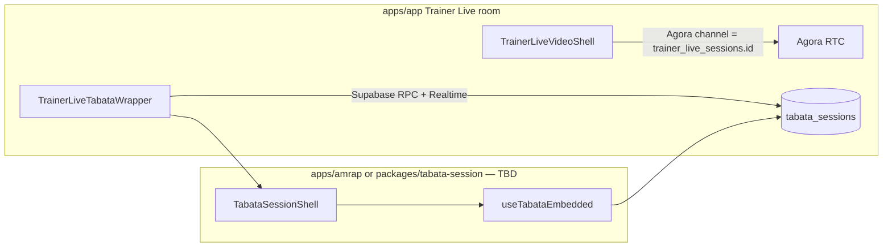

# Technical Design: Trainer Live — Tabata interval wrapper (Video + Intervals)

**Status:** Design — pending review.  
**Parent:** [TRAINER_LIVE_INTERVAL_WRAPPERS_TDD.md](./TRAINER_LIVE_INTERVAL_WRAPPERS_TDD.md) (Option A: `interval_wrapper_kind` + `interval_wrapper_config` on `trainer_live_sessions`).  
**Reference implementation:** [TRAINER_LIVE_AMRAP_WRAPPER_TDD.md](./TRAINER_LIVE_AMRAP_WRAPPER_TDD.md), [`TrainerLiveAmrapWrapper`](../apps/app/src/lib/trainer-live/wrappers/amrap/TrainerLiveAmrapWrapper.tsx), [`useSocialAmrapEmbedded`](../apps/amrap/src/embed/index.ts), [`AmrapSessionShell`](../apps/amrap/src/components/amrap-session/AmrapSessionShell.tsx) (`shellLayout="trainerLiveEmbed"`).  
**Related:** [TRAINER_VIDEO_SESSION_TDD.md](./TRAINER_VIDEO_SESSION_TDD.md) (multi-shell Trainer Live product), [MISSION_CONTROL_WORKOUT_FACTORY_V1_TDD.md](./MISSION_CONTROL_WORKOUT_FACTORY_V1_TDD.md) (workouts stored in full fidelity for future shells), [TRAINER_LIVE_P3_PROTOCOL_SYNC_TDD.md](./TRAINER_LIVE_P3_PROTOCOL_SYNC_TDD.md) (lightweight Tabata/EMOM sync — **different** approach; see §3.3).

---

## 1. Purpose

Add a **`tabata`** interval tool to the **Video + Intervals** layout (`shell = 'countdown_timer'`) so trainers can run **classic Tabata timing** next to the existing Trainer Live video grid, reusing the **same integration shape as the AMRAP wrapper**: registry entry, embedded engine, **single Agora channel** (`trainer_live_sessions.id`), and **no second video stack** inside the interval app.

**Product definition (v1):**

- **Timing:** **20 seconds work / 10 seconds rest** per interval (fixed for v1; configurable ratios are a later product decision).
- **Structure:** A **Tabata block** is **N work/rest pairs** (default **N = 8**). One full block at N = 8 is **4 minutes** (8 × 30s).
- **No AMRAP-style round logging:** There is **no** “log round” leaderboard loop. Progress is **set index / phase** (waiting → work → rest → … → finished). Optional **completion or streak UI** is secondary; parity with AMRAP leaderboard is **not** a goal.
- **Session composition:** Unlike AMRAP, where a single `amrap_sessions` row often carries a **multi-minute clock** (5 / 15 / 20) and **round counts**, Tabata is modeled as **one or more discrete Tabata blocks** in a Trainer Live session. The trainer **loads 1, 2, 3, …** Tabata intervals (each backed by a dedicated session row or segment) so total wall time is **sum of block durations**, not one long AMRAP clock with intra-session round logging.

**Workout data:** Tabata-oriented workouts are **generated and stored** the same way as other Mission Control outputs (e.g. **Balanced Tabata** and timer-schema blocks in `public.workouts`). The Tabata shell consumes that data via a **server-side create/attach path** and/or a **client adapter** (same pattern as the AMRAP workout picker adapter in [MISSION_CONTROL_WORKOUT_FACTORY_V1_TDD.md](./MISSION_CONTROL_WORKOUT_FACTORY_V1_TDD.md) §207).

**Saved workouts filter:** [`TrainerLiveTabataWorkoutPickerModal`](../apps/app/src/components/react/trainer/live/TrainerLiveTabataWorkoutPickerModal.tsx) lists only rows whose `ai_chain_metadata.workoutConfig` indicates **Balanced Tabata** (`factoryMetabolicMode === 'tabata_balanced'` from [`workout-factory-metabolic-mode.ts`](../apps/app/src/lib/trainer-live/workout-factory-metabolic-mode.ts)).

---

## 2. Goals and non-goals

### Goals

| ID | Goal |
|----|------|
| **TG1** | **Same wrapper contract** as AMRAP: [`TrainerLiveWrapperBaseProps`](../apps/app/src/lib/trainer-live/wrappers/types.ts), registry registration, `TrainerLiveSessionRoom` sidebar slot. |
| **TG2** | **Single video channel:** Tabata code **must not** initialize a second Agora channel; embed hook uses **`skipAgora: true`** (or equivalent) mirroring [`useSocialAmrapEmbedded`](../apps/amrap/src/embed/index.ts). |
| **TG3** | **Trainer authority:** Create/start/pause/skip/finish Tabata blocks via **SECURITY DEFINER** RPCs verifying `auth.uid() = trainer_live_sessions.trainer_user_id`. |
| **TG4** | **Configurable set count:** Default **8** sets; trainer may select **fewer or more** per block (within bounds enforced in RPC + UI). |
| **TG5** | **Multiple blocks per Trainer Live session:** Support **sequential** Tabata intervals (new block = new `tabata_session_id` or equivalent row), integrated with **activity segments** (mirror **AMRAP block** UX in [`TrainerLiveActivityTimer`](../apps/app/src/components/react/trainer/live/TrainerLiveActivityTimer.tsx)). |
| **TG6** | **Reuse AMRAP shell patterns:** Shared **embed wrapper** layout (`trainerLiveEmbed`-style), **AmrapAuthProvider** or a **shared session auth provider** if renamed, **hideMessageBoard** behavior, and **presentational shell** split (engine hook + `*SessionShell` component). |

### Non-goals

| ID | Non-goal |
|----|----------|
| **TN1** | **Leaderboard / round splits** comparable to AMRAP (no per-round logging). |
| **TN2** | **Arbitrary work:rest ratios** in v1 (stay 20:10 unless product explicitly expands). |
| **TN3** | **P3 `trainer_live_session_state`** as the primary store for this feature — see §3.3. |
| **TN4** | Changing **seat cap**, Agora token rules, or `trainer_live_participants` join model. |

---

## 3. Relationship to AMRAP and P3

### 3.1 Same column, new kind

Extend **`trainer_live_sessions.interval_wrapper_kind`** to include **`'tabata'`** (migration: widen [`trainer_live_sessions_interval_wrapper_kind_check`](../supabase/migrations/20260430200000_trainer_live_interval_wrapper.sql)).

**`interval_wrapper_config` (v1 sketch):**

```json
{
  "tabata_session_id": "<uuid>"
}
```

Validation in app: same UUID parsing pattern as [`parseAmrapSessionIdFromWrapperConfig`](../apps/app/src/lib/trainer-live/wrappers/parseWrapperConfig.ts) (new `parseTabataSessionIdFromWrapperConfig` or generic helper).

### 3.2 Parallels to AMRAP

| Concern | AMRAP | Tabata (this doc) |
|--------|--------|-------------------|
| Primary metric | Rounds logged, leaderboard | **Interval index** / phase; no round log |
| Session duration | `duration_minutes` on `amrap_sessions` | **Derived from** N × (20+10) for the block |
| Multiple blocks | “AMRAP block” segment + new `amrap_session_id` | **“Tabata block”** segment + new `tabata_session_id` |
| Embed | `useSocialAmrapEmbedded` + `AmrapSessionShell` | **`useTabataEmbedded`** (name TBD) + **`TabataSessionShell`** |
| Video | Trainer Live drawer / `skipAgora` | Same |

### 3.3 Distinction from P3 (Tabata / EMOM sync)

[TRAINER_LIVE_P3_PROTOCOL_SYNC_TDD.md](./TRAINER_LIVE_P3_PROTOCOL_SYNC_TDD.md) proposes **native protocol state** on `trainer_live_session_state` with **no AMRAP feature parity** and a possible **`shell` enum extension** (`tabata`, `emom`).

**This Tabata wrapper** intentionally follows the **AMRAP-style path**: `shell` stays **`countdown_timer`**, **`interval_wrapper_kind = 'tabata'`**, and a **dedicated Tabata session table + RPCs** for full timer semantics and future reuse outside P3.

**Decision for implementers:** Do **not** block Tabata v1 on P3. If P3 ships later, either **merge** (Tabata wrapper reads P3 state) or **keep** the dedicated table — pick one in implementation; this doc assumes **dedicated `tabata_sessions`** for v1 clarity.

---

## 4. Architecture



**Placement:** Prefer implementing **`TabataSessionShell`** and **`useTabataEmbedded`** **next to** AMRAP in [`apps/amrap`](../apps/amrap) **if** shared types, theming, and embed exports stay manageable; otherwise extract **`packages/tabata-session`** or a **`packages/trainer-live-interval-core`** only when bundle or circular-dependency pressure requires it.

**`TrainerLiveSessionRoom`:** Add a branch for `interval_wrapper_kind === 'tabata'` parallel to [`amrap`](../apps/app/src/components/react/trainer/live/TrainerLiveSessionRoom.tsx) (same video drawer default: **closed when Tabata active** if product wants parity with AMRAP).

---

## 5. Data model

### 5.1 New table: `tabata_sessions` (sketch)

Server-authoritative state for one **Tabata block** (one embed instance).

| Column | Type | Notes |
|--------|------|--------|
| `id` | uuid PK | |
| `created_at` | timestamptz | |
| `created_by` | uuid | `auth.users` (trainer) |
| `work_seconds` | int NOT NULL DEFAULT 20 | v1 fixed at 20; keep column for future |
| `rest_seconds` | int NOT NULL DEFAULT 10 | v1 fixed at 10 |
| `round_count` | int NOT NULL | Number of work intervals (default 8; **trainer configurable**) |
| `workout_list` | jsonb | Exercise order / labels per interval or per rotation — **shape TBD** to match Mission Control blocks + adapter |
| `state` | jsonb | Timer phase, current index, paused, started_at, etc. — **validated in RPC** |
| `trainer_live_session_id` | uuid NULL FK → `trainer_live_sessions(id)` | Optional but **recommended** for analytics and cleanup |

**RLS:** Trainer + participants with a valid `trainer_live_participants` row for the linked session may **read**; **writes** via RPC only.

### 5.2 Activity timer integration

Mirror [**`trainer_live_activity_begin_amrap_segment`**](../supabase/migrations/20260430230000_trainer_live_activity_timer.sql):

- **`trainer_live_activity_begin_tabata_segment(p_trainer_live_session_id uuid, p_label text, …)`**  
  - Preconditions: `shell = 'countdown_timer'`, activity timer **active**, caller is trainer.  
  - Creates **`tabata_sessions`** row (and closes prior segment bookkeeping like AMRAP).  
  - Sets `interval_wrapper_kind = 'tabata'`, `interval_wrapper_config = { "tabata_session_id": … }`.  
  - Returns tokens/ids if clients need participant join (only if model requires; see §5.3).

**Trainer UI:** Add **“Tabata block”** (or reuse a single **“Interval block”** menu) alongside **AMRAP block** in [`TrainerLiveActivityTimer`](../apps/app/src/components/react/trainer/live/TrainerLiveActivityTimer.tsx), opening a **Tabata workout picker** (N sets + optional workout from library) before starting the segment.

### 5.3 Participant identity

- If Tabata needs **per-client sync** (phase visible to all), reuse the **read-only subscriber** pattern: clients **do not** need a “log round” identity; optional **`tabata_participants`** row is **only** needed if v1 ships **presence** or **completion ticks**.  
- **Default v1:** **Server state + Realtime** broadcast to all participants in the Trainer Live session; **no** guest round token unless required for writes.

---

## 6. Engine and shell (reuse AMRAP patterns)

### 6.1 Hook: `useTabataEmbedded`

Analogous to `useSocialAmrapEmbedded`:

- `tabataSessionId: string`
- `embedVideo: 'trainer_live'` → **`skipAgora: true`**
- `hideMessageBoard: true` (Trainer Live chat is canonical)
- Subscribes to `tabata_sessions` + Realtime updates
- Exposes a **`TabataEngine`** interface: `timerPhase`, `currentRoundIndex`, `displayValue`, `onPause`, `onResume`, `onSkipRest`, `onFinish`, `loading`, `error`, etc.

### 6.2 `TabataSessionShell`

- **`shellLayout: 'default' | 'trainerLiveEmbed'`** — copy the **layout split** from [`AmrapSessionShell`](../apps/amrap/src/components/amrap-session/AmrapSessionShell.tsx): embed = **timer first**, then **exercise / progress** below; **no leaderboard column**.  
- **Styling:** Reuse AMRAP **tokens** (`#0d0500`, borders, orange accent) for visual consistency.  
- **Trainer controls:** Pause / resume / finish / skip rest (product list); **no** “LOG ROUND”.

### 6.3 `TrainerLiveTabataWrapper` (apps/app)

- Parse `wrapperConfig` → `tabata_session_id`
- Wrap with `AmrapAuthProvider` (or shared provider) **if** Supabase auth boundary matches AMRAP; otherwise **`TrainerLiveAuth`** only — **resolve during implementation**
- Mount `TabataSessionShell` with `shellLayout="trainerLiveEmbed"`
- Forward errors to `onWrapperError` like [`TrainerLiveAmrapWrapper`](../apps/app/src/lib/trainer-live/wrappers/amrap/TrainerLiveAmrapWrapper.tsx)

### 6.4 Registry

Extend [`TrainerLiveIntervalWrapperKind`](../apps/app/src/lib/trainer-live/wrappers/types.ts) and [`registry.tsx`](../apps/app/src/lib/trainer-live/wrappers/registry.tsx):

```ts
tabata: TrainerLiveTabataWrapper
```

Update [`parseIntervalWrapperKind`](../apps/app/src/lib/trainer-live/wrappers/kind.ts) to accept `'tabata'`.

---

## 7. Workouts: generation, storage, attach

- **Storage:** Continue storing full-fidelity workouts in **`public.workouts`** as today ([MISSION_CONTROL_WORKOUT_FACTORY_V1_TDD.md](./MISSION_CONTROL_WORKOUT_FACTORY_V1_TDD.md)).
- **Attach RPC:** **`trainer_live_attach_tabata_session`** (name TBD) accepts `p_workout_id` or inline `p_workout_list` + `p_round_count`, **maps** block data into `tabata_sessions.workout_list`, and sets Trainer Live wrapper columns — **parallel** to `trainer_live_attach_amrap_session`.
- **Adapter:** Client-side mapping from workout JSON → Tabata RPC payload should mirror the **AMRAP adapter** pattern (single place for flattening exercise order and labels).

---

## 8. UI / UX

- **Sidebar:** Tabata shell occupies the **same center column** as AMRAP when `interval_wrapper_kind === 'tabata'`.  
- **Video drawer:** Match AMRAP behavior (`defaultOpen={intervalWrapperKind !== 'tabata'}`) unless product prefers always-on video.  
- **Empty states:** When `kind === 'none'`, Tabata appears in the **trainer picker** list (“Tabata”) alongside AMRAP / simple countdown.  
- **Switching tools:** Same rules as AMRAP: trainer-only; confirm if switching mid-block.  
- **Multi-block:** After a block **finishes**, trainer may start another **Tabata block** from the activity timer (new segment, new `tabata_session_id`).

---

## 9. Security

- **RPCs:** Same as AMRAP — only **`trainer_user_id`** may create/attach/mutate Tabata state for the session.  
- **Config JSON:** Only **`tabata_session_id`** (UUID); no secrets.  
- **RLS:** Participants read; no broad `UPDATE` on `tabata_sessions` from clients.

---

## 10. Testing

| Layer | Test |
|-------|------|
| **Unit** | Parse `interval_wrapper_config` for Tabata; invalid UUID rejected. |
| **Unit** | `useTabataEmbedded` does not initialize Agora (mirror AMRAP embed test). |
| **Integration** | `trainer_live_activity_begin_tabata_segment` sets kind + config; Realtime updates visible to client. |
| **E2E (manual)** | Trainer stacks 2–3 Tabata blocks; total time ≈ sum of block lengths; no round log UI. |

---

## 11. Phased delivery checklist

| Step | Deliverable |
|------|-------------|
| **T0** | Migration: `interval_wrapper_kind` includes `'tabata'`; `tabata_sessions` + RLS + RPCs. |
| **T1** | `useTabataEmbedded` + `TabataSessionShell` (`trainerLiveEmbed`) in `apps/amrap` (or chosen package). |
| **T2** | `TrainerLiveTabataWrapper` + registry + `TrainerLiveSessionRoom` branch + `parseIntervalWrapperKind`. |
| **T3** | Activity timer: **Tabata block** + picker; **attach** RPC + workout adapter from Mission Control rows. |
| **T4** | Join hints / Realtime: clients see `tabata` kind + config without reload. |
| **T5** | [COMMANDS.md](./COMMANDS.md) dev notes if needed. |

---

## 12. Open questions

1. **Package boundary:** Keep Tabata inside `apps/amrap` vs new `packages/*` — decide by bundle size and team ownership.  
2. **Exercise list UX:** One exercise per work interval vs rotating list — must match `workout_list` JSON contract.  
3. **Sound / cues:** Reuse AMRAP beep assets or Trainer Live global sounds?  
4. **Analytics:** Event names for `trainer_live_tabata_block_start` / `tabata_block_complete` (align with P4 allowlists when applicable).  
5. **P3 convergence:** If P3 ships, does Tabata wrapper delegate to `trainer_live_session_state` or keep `tabata_sessions`?

---

## 13. Summary

Tabata in Trainer Live reuses the **AMRAP wrapper integration model**: **`interval_wrapper_kind = 'tabata'`**, **`interval_wrapper_config`**, an **embedded engine + shell** with **no second Agora channel**, and **activity-segment RPCs** to stack **multiple 4-minute-class Tabata blocks** per session. It **does not** replicate AMRAP’s **round logging**; it **does** replicate **workout storage, attach patterns, and Mission Control** alignment. **P3** remains a separate, lighter sync track unless the team explicitly merges designs later.
