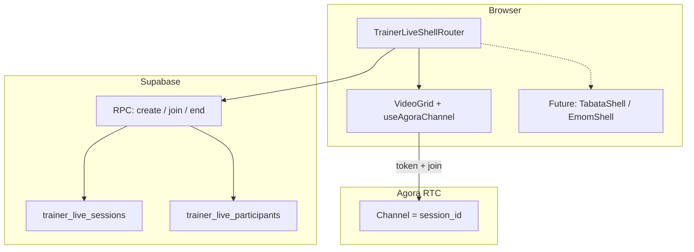

# Technical Design: Trainer Live Video Sessions (multi-shell)

**Status:** P0 implemented (migrations, `/api/trainer-live/agora-token`, `/trainer/live/*` UI, `npm run dev:trainer:live`).  
**Last updated:** April 2, 2026  
**Related:** [PERFORMANCE_LAB_TDD.md](./PERFORMANCE_LAB_TDD.md) (trainer Mission Control; explicitly defers video to a separate surface), [AMRAP_WITH_FRIENDS_LIVE_STREAMING_SWOT.md](./AMRAP_WITH_FRIENDS_LIVE_STREAMING_SWOT.md), [ROADMAP_AMRAP_VIDEO_INTEGRATION.md](./ROADMAP_AMRAP_VIDEO_INTEGRATION.md), [TRAINER_LIVE_INTERVAL_WRAPPERS_TDD.md](./TRAINER_LIVE_INTERVAL_WRAPPERS_TDD.md) (**Video + Intervals** — interval app wrappers; AMRAP first; design doc), [TRAINER_LIVE_AMRAP_WRAPPER_TDD.md](./TRAINER_LIVE_AMRAP_WRAPPER_TDD.md) (AMRAP embed implementation spec), [TRAINER_LIVE_P3_PROTOCOL_SYNC_TDD.md](./TRAINER_LIVE_P3_PROTOCOL_SYNC_TDD.md) (P3 Tabata/EMOM + sync — design doc; implementation pending approval), [TRAINER_LIVE_P4_LONG_SESSION_METRICS_TDD.md](./TRAINER_LIVE_P4_LONG_SESSION_METRICS_TDD.md) (P4 token renewal, metrics, max duration — design doc; implementation pending approval), `apps/amrap` (Agora + session shell), `apps/trainer-chat` (early video layout prototype)

---

## 1. Purpose

**AMRAP With Friends** is a quick social workout: one shared **AMRAP Session shell** (timer, rounds, leaderboard, video in context). Trainers can use it with clients, but the product and schema are **AMRAP-centric** (`amrap_sessions`, `amrap_participants`, round logging, host token for timer RPCs).

This document defines a **trainer-first live video product** that:

- Is **not** tied to the AMRAP session engine or `AmrapSessionShell`.
- Starts as a **basic group video room**: **one trainer + up to six clients** (seven seats total).
- Evolves toward **selectable timer shells** (Tabata, EMOM, AMRAP, etc.) where each shell is a **pluggable UI + optional sync layer**, reusing patterns proven in AMRAP (Agora + Supabase) without inheriting AMRAP-specific tables or routes.

**Product principle:** The trainer is the authority for who is in the room and (later) which protocol runs; the **video layer is the stable foundation**; timer shells are **composable overlays** or **side-by-side layouts**, not a fork of `AmrapSessionPage`.

---

## 2. Goals and non-goals

### Goals

- **G1 — Video-first MVP:** Create/join flow, grid layout (trainer prominent), mic/camera toggles, leave, graceful degradation without video (same spirit as AMRAP’s `agoraError` banner).
- **G2 — Seat cap:** Enforce **trainer (1) + clients (≤6)** at the database layer (RPC), aligned with Agora subscription UX and support cost.
- **G3 — Security parity with AMRAP tokens:** Issue Agora tokens only after verifying a row in a **participant table** for the given channel (session id), using **`buildTokenWithUserAccount`** with **account = participant UUID** (same approach as [`api/agora-token.ts`](../api/agora-token.ts) + [`apps/amrap/src/lib/agora.ts`](../apps/amrap/src/lib/agora.ts)).
- **G4 — Shell-ready architecture:** Introduce a **shell type** (enum / discriminated union) on the session row so future work can add `shell: 'video_only' | 'tabata' | 'emom' | ...` without another migration rename.
- **G5 — Copy and improve AMRAP/trainer-chat code:** Prefer extracting or cloning **`useAgoraChannel`**, token fetch, and tile/layout components into a **shared package or `apps/app` module**, then deleting drift-prone duplicates over time.

### Non-goals (initial phases)

- **N1:** Porting the full AMRAP timer, rounds, or `update_session_state` RPCs into this feature.
- **N2:** Implementing every timer shell in v1; only **one shell** (`video_only`) ships first.
- **N3:** Cloud recording, transcription, or billing metering (can reuse Agora roadmap later).
- **N4:** Replacing `trainer-chat` in one shot; it remains a reference prototype until code is consolidated.

---

## 3. Positioning vs existing systems

| Concern | AMRAP With Friends | Trainer Live (this TDD) | `trainer-chat` app |
|--------|-------------------|-------------------------|--------------------|
| Primary user | Host + friends | Trainer + roster clients | Generic demo |
| Session schema | `amrap_sessions` + rounds | New `trainer_live_*` tables | None (local/demo) |
| Agora channel id | `amrap_sessions.id` | New session UUID | Ad hoc |
| Agora user account | `amrap_participants.id` | New participant UUID | Numeric uid / legacy |
| Timer / protocol | Built-in AMRAP | Optional future shells | None |

**Decision:** Do **not** overload `amrap_sessions` for trainer-generic video. A separate bounded context keeps RLS simpler, avoids AMRAP join limits (today `join_session` caps **total** participants at 6 — different from trainer + six clients), and prevents AMRAP-specific columns from leaking into trainer flows.

---

## 4. Information architecture and routing

### 4.1 Suggested URLs (hub app, `apps/app`)

Trainers already work under **`/trainer`** (basename). Proposed routes:

| Route | Actor | Purpose |
|-------|--------|---------|
| `GET /trainer/live` | Trainer | Create session or list recent sessions (MVP: create + redirect) |
| `GET /trainer/live/:sessionId` | Trainer | Host console (video + future shell) |
| `GET /trainer/live/join/:sessionId` | Client | Join as client (nickname / auth as required) |

**Alternate:** Client join at `/live/join/:sessionId` with a short public code if marketing wants less “trainer” in the URL; security still ties to participant row + optional invite secret.

### 4.2 Deep links from Performance Lab / Roster

Optional P1: From [`PERFORMANCE_LAB_TDD.md`](./PERFORMANCE_LAB_TDD.md) client context, **“Start live session”** pre-associates `trainer_live_sessions.client_user_id` or a join allowlist (see §6). Not required for bare MVP.

---

## 5. Architecture overview

**Shell router (conceptual):** A small component reads `session.shell` (or `session.shell_kind`) and renders:

- **`video_only`:** Video grid + controls only.
- **Future shells:** Lazy-load a shell module that receives `sessionId`, `participantId`, `role`, and shared `useAgoraChannel` instance (or context) so video is not torn down when switching shell metadata (if ever allowed live — otherwise shell is fixed at create time).

---

## 6. Data model

### 6.1 Tables (new, `public` or `trainer` schema)

**`trainer_live_sessions`**

| Column | Type | Notes |
|--------|------|--------|
| `id` | uuid PK | Agora **channel name** |
| `trainer_user_id` | uuid FK → `auth.users` | Host; must match authenticated trainer on create |
| `shell` | text | Check: `'video_only' \| 'countdown_timer'` (P2 adds second shell) |
| `status` | text | `'active' \| 'ended'` (or `scheduled` later) |
| `invited_client_user_id` | uuid nullable (P1) | When set, only that `auth.users` id may join as client; trainer must have roster enrollment (`user_programs` + `programs.trainer_id`) |
| `invite_code` | text optional | Short code for join URL; unique when set (not used in P0/P1) |
| `created_at`, `ended_at` | timestamptz | Audit / cleanup |

**`trainer_live_participants`**

| Column | Type | Notes |
|--------|------|--------|
| `id` | uuid PK | Agora **user account** string |
| `session_id` | uuid FK | |
| `role` | text | `'trainer' \| 'client'` |
| `display_name` | text | |
| `user_id` | uuid nullable | Set when joiner is authenticated (trainer roster clients) |
| `joined_at` | timestamptz | |

**Indexes:** `(session_id)`, `(invite_code)` unique partial where not null.

**RLS (sketch):**

- Trainers read/update sessions they own; participants read their session.
- Inserts into `trainer_live_participants` for **client** role via `SECURITY DEFINER` RPC only (same pattern as AMRAP `join_session`).

### 6.2 RPCs

1. **`trainer_live_create_session(p_shell text default 'video_only', p_invited_client_user_id uuid default null)`** (P1 adds optional invite + roster validation)  
   - Auth: JWT must be trainer (reuse existing trainer role claim or server-side check used by `/api/trainer/*`).  
   - Inserts session + one **trainer** participant row.  
   - Returns `{ session_id, participant_id }`.

2. **`trainer_live_join_session(p_session_id uuid, p_display_name text default 'Guest')`**  
   - Validates session `active`, optional `invited_client_user_id` match when set, **count of client rows < 6**.  
   - Authenticated joiners: `display_name` prefers `profiles.full_name` / `username` over `p_display_name`.  
   - Returns `{ participant_id }`.

3. **`trainer_live_session_join_hints(p_session_id uuid)`** (P1; P2 adds `shell`) — returns `{ active, requires_invited_account, shell }` without exposing the invitee UUID. Inactive sessions return `shell: 'video_only'`.

4. **`trainer_live_end_session(p_session_id uuid)`**  
   - Sets `status = ended`; disconnects are already client-side; helps token denial for new joins.

**Capacity rule:**  
`SELECT count(*) FROM trainer_live_participants WHERE session_id = ? AND role = 'client'` must be **< 6** before inserting a new client. Trainer row is separate.

---

## 7. Agora integration

### 7.1 Channel and identity

- **Channel:** `trainer_live_sessions.id` (UUID string).
- **User account:** `trainer_live_participants.id` (UUID string).  
  Matches AMRAP’s pattern in [`useAgoraChannel`](../apps/amrap/src/hooks/useAgoraChannel.ts) and avoids integer uid collisions from [`trainer-chat`](../apps/trainer-chat/src/components/VideoCallLayout.tsx)’s legacy `uid === '1'` host assumption.

### 7.2 Token endpoint

**Option A (recommended):** New route **`GET /api/trainer-live/agora-token?channel=&account=`** that:

- Validates UUIDs.
- Verifies `(account, channel)` exists in **`trainer_live_participants`** join **`trainer_live_sessions`** with `status = active`.
- Uses same CORS and env vars as [`api/agora-token.ts`](../api/agora-token.ts) (`VITE_AGORA_APP_ID`, certificate, `AGORA_TOKEN_ALLOWED_ORIGINS`).

**Option B:** Single `/api/agora-token` with `?scope=amrap|trainer_live` and branch validation (slightly higher coupling).

**Dev:** Extend Astro proxy (or Vite if shell lives in a sub-app) to forward **`/api/trainer-live/agora-token`** to `trainer-chat/server/token-server.js` **or** duplicate a tiny trainer-live validation in the token server for local dev. Long-term, one token server with pluggable validators is ideal.

### 7.3 Client code to reuse / extract

| Source | Artifact | Action |
|--------|----------|--------|
| [`apps/amrap/src/hooks/useAgoraChannel.ts`](../apps/amrap/src/hooks/useAgoraChannel.ts) | Join/leave, remote user state, mute | **Copy → shared** (`packages/live-video-core` or `apps/app/src/lib/live-video/`) and parameterize **token URL** |
| [`apps/amrap/src/lib/agora.ts`](../apps/amrap/src/lib/agora.ts) | `getTokenOrFetchWithAccount` | Generalize base path (`/api/agora-token` vs `/api/trainer-live/agora-token`) |
| [`apps/amrap/src/components/amrap-session/VideoSourcePlayer.tsx`](../apps/amrap/src/components/amrap-session/VideoSourcePlayer.tsx) | Track → `<video>` | Reuse for local/remote tiles in non-AMRAP UI |
| [`apps/trainer-chat/src/components/VideoCallLayout.tsx`](../apps/trainer-chat/src/components/VideoCallLayout.tsx) | Grid / host emphasis | **Rewrite** to use UUID-based host detection (participant `role === 'trainer'` map), not `uid === '1'` |
| [`apps/trainer-chat/src/components/VideoTile.tsx`](../apps/trainer-chat/src/components/VideoTile.tsx) | Tile chrome | Merge with AMRAP styling tokens / Tailwind patterns from app |

**Improvements over raw copy:**

- Single **`useAgoraChannel({ channelName, participantId, tokenPath })`** to support both products until fully unified.
- Centralize **error strings** (env, cert, 403 participant not found) like AMRAP already does in hooks.
- **StrictMode-safe leave/join** (`previousLeavePromiseRef` pattern already in AMRAP hook).

---

## 8. UI: MVP shell (`video_only`)

### 8.1 Trainer view

- Large primary tile: self-preview or spotlight (configurable later).
- Up to six client tiles in a responsive grid (2×3 / 3×2).
- Toolbar: mute mic, mute camera, copy invite link, end session for all (soft: mark ended + navigate away).

### 8.2 Client view

- Prominent remote trainer video.
- Local picture-in-picture (or bottom strip) + peers optional (gallery of other clients is nice-to-have; MVP can show trainer + self only to save bandwidth).

### 8.3 Empty states

- Waiting room message until first client joins.
- “Session full” from RPC surfaced before Agora join.

---

## 9. Phased delivery

| Phase | Scope |
|-------|--------|
| **P0** | Migrations + RLS + RPCs; trainer create + client join; `video_only` shell; Agora token route; minimal UI in `apps/app` under `/trainer/live/*`; dev proxy for token | **complete** 
| **P1** | Roster integration (`trainer_live_sessions.invited_client_user_id`, roster check on create, join enforcement); `trainer_live_session_join_hints` for join UX without leaking invitee id; authenticated clients get `display_name` from `profiles` in join RPC | **complete** |
| **P2** | Second shell **`countdown_timer`** (video + local trainer countdown panel); `TrainerLiveSessionRoom` shell router; lobby shell picker; `join_hints.shell` for client layout — **complete** (timer is **not** synchronized across participants until P3). **Follow-up:** pluggable interval wrappers + AMRAP — [TRAINER_LIVE_INTERVAL_WRAPPERS_TDD.md](./TRAINER_LIVE_INTERVAL_WRAPPERS_TDD.md) |
| **P3** | Protocol-specific shells (Tabata / EMOM) with shared **session sync** (`trainer_live_session_state` jsonb + `version`, `protocol_config` on session, trainer-only RPC `trainer_live_protocol_apply_patch`, Realtime). **Design:** [TRAINER_LIVE_P3_PROTOCOL_SYNC_TDD.md](./TRAINER_LIVE_P3_PROTOCOL_SYNC_TDD.md). **Implementation:** pending approval of that doc (checklist §11 there). |
| **P4** | Token refresh (`expires_at` on token API, `token-privilege-will-expire` + `renewToken` in [`useTrainerLiveAgoraChannel`](../apps/app/src/hooks/useTrainerLiveAgoraChannel.ts)); product metrics via `trackEvent` + `FUNNEL_EVENTS`; optional max session duration at token layer (`session_cap_at` or `created_at` interval). **Design:** [TRAINER_LIVE_P4_LONG_SESSION_METRICS_TDD.md](./TRAINER_LIVE_P4_LONG_SESSION_METRICS_TDD.md). **Implementation:** pending approval (checklist §8 there). |

---

## 10. Security and abuse

- **Token issuance:** Never issue without DB row (same lesson as AMRAP [`api/agora-token.ts`](../api/agora-token.ts)). Production [`agora-token.ts`](../apps/app/src/pages/api/trainer-live/agora-token.ts) calls `trainer_live_verify_token_targets` (SECURITY DEFINER) so verification does not depend on permissive anon `SELECT` on session/participant tables; see [`20260430116000_trainer_live_rls_hardening.sql`](../supabase/migrations/20260430116000_trainer_live_rls_hardening.sql).
- **Trainer-only create:** RPC checks `auth.uid() = trainer_user_id` on insert path (or server API uses service role + explicit trainer check — prefer DB-side for consistency with AMRAP RPC style).
- **Join:** Public link acceptable if `invite_code` is unguessable (UUID in path + optional short code); rate-limit join attempts at edge if needed.
- **Privacy:** Clients should see they are on camera; mirror AMRAP’s clear error UX when permissions denied.

---

## 11. Testing

- **Unit:** RPC capacity (6 clients + 1 trainer), duplicate join, ended session rejection.
- **Integration:** Token endpoint 403 when participant missing.
- **E2E (manual):** Two browsers: trainer + client; third through seventh clients until cap; verify Agora subscribe count.

---

## 12. Architecture decisions (current implementation)

These supersede the earlier “open questions” list for P0–P2.

1. **Hosting — `apps/app` only.** Trainer Live ships inside the existing Mission Control React subtree ([`TrainerRoute.tsx`](../apps/app/src/components/react/trainer/TrainerRoute.tsx) under `/trainer/live/*`), with Agora + token wiring colocated (`src/lib/trainer-live/`, `src/pages/api/trainer-live/agora-token.ts`). There is **no** separate `apps/trainer-live` Vite app. Tradeoff accepted: larger shared client bundle vs faster integration with Supabase auth, `/trainer` layout, and existing patterns.

2. **Guest clients — hybrid.** **`trainer_live_join_session`** is granted to **`anon` and `authenticated`** ([`20260430113000_trainer_live_video.sql`](../supabase/migrations/20260430113000_trainer_live_video.sql)). **Open lobby** sessions (`invited_client_user_id` is null): clients may join with a **display name** only (default `Guest`); `user_id` on the participant row stays null for anonymous joins. **Roster-targeted** sessions (create from client Mission Control with `p_invited_client_user_id`): DB enforces **sign-in** and **account match** to the invitee; [`trainer_live_session_join_hints`](../supabase/migrations/20260430114000_trainer_live_p1_roster.sql) exposes `requires_invited_account` so the join UI can gate on auth before calling join. **Signed-in** clients get display name from **`profiles`** when available (full name / username), with the typed name as fallback.

3. **Schema namespace — `public.trainer_live_*`.** All session/participant tables and RPCs live under **`public`** with the `trainer_live_` prefix (e.g. `public.trainer_live_sessions`). A dedicated Postgres schema (e.g. `trainer`) was **not** introduced; if table count grows, a future migration could move objects behind a schema boundary.

4. **Agora project — shared env, ops split optional.** The app uses **`VITE_AGORA_APP_ID`** (client) and **`VITE_AGORA_APP_CERTIFICATE`** (server/token path only), wired like AMRAP in [COMMANDS.md](./COMMANDS.md) / [astro.config.mjs](../apps/app/astro.config.mjs) `define`. **No** second Agora project is required by the code; isolating Trainer Live usage in a **separate Agora project** for billing or quotas remains an **operational** choice, not reflected in the repo.

---

## 13. Documentation and ops

- Add a **Commands** subsection to [COMMANDS.md](./COMMANDS.md): e.g. `npm run dev:trainer:live` = `dev:app` + token server (mirror `dev:amrap:video`).
- Link this TDD from [PERFORMANCE_LAB_TDD.md](./PERFORMANCE_LAB_TDD.md) §2 non-goals when video ships: “See TRAINER_VIDEO_SESSION_TDD.md.”

---

## 14. Summary

Trainer Live Video is a **new bounded context**: dedicated session + participant tables, **trainer + six clients**, Agora wiring **copied and generalized** from AMRAP (`useAgoraChannel`, UUID accounts, token validation), layout lessons from **`trainer-chat`** without its uid hacks, and a **`shell` column** so timer protocols become **incremental shells** instead of a second AMRAP clone.
